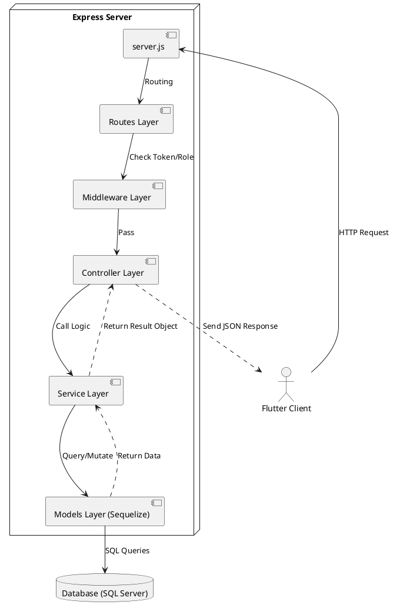
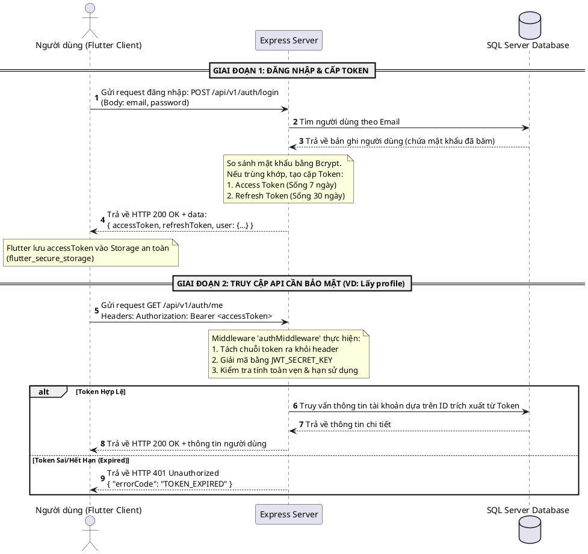

# BÁO CÁO KỸ THUẬT: KIẾN TRÚC API NODE.JS/EXPRESS & LUỒNG XÁC THỰC JWT

> [!NOTE]
> Tài liệu này được biên soạn dành cho dự án **Chatbot TOEIC - Hệ thống Luyện Thi TOEIC Thông Minh**. Tài liệu bao gồm lý thuyết cơ bản về API, hướng dẫn viết API hoàn chỉnh bằng Node.js/Express, giải thích luồng xác thực JWT, và đặc tả chi tiết toàn bộ các RESTful API của hệ thống.

---

## 1. Cơ Chế Hoạt Động Của API Trong Node.js/Express

### 1.1 Khái Niệm API & Chuẩn RESTful API
**API (Application Programming Interface)** đóng vai trò làm cầu nối cho phép hai ứng dụng khác nhau giao tiếp với nhau. Trong dự án này, ứng dụng di động/web viết bằng **Flutter (Client)** giao tiếp với máy chủ **Node.js (Server)** thông qua các yêu cầu HTTP.

Hệ thống sử dụng chuẩn **RESTful API**, tuân thủ các nguyên tắc cốt lõi:
1. **Stateless (Không lưu trạng thái):** Mỗi request gửi từ Client lên Server phải chứa đầy đủ thông tin cần thiết để xử lý request đó. Server không lưu trữ session của người dùng trên bộ nhớ RAM.
2. **Tài nguyên (Resources):** Mỗi thực thể (User, Test, Question, Message) được coi là một tài nguyên và được định danh bằng một URI duy nhất dạng danh từ số nhiều (ví dụ: `/api/v1/users`, `/api/v1/tests`).
3. **HTTP Methods (Động từ HTTP):** Sử dụng các phương thức chuẩn để xác định hành động:
   *   `GET`: Lấy thông tin tài nguyên.
   *   `POST`: Tạo mới tài nguyên.
   *   `PUT`/`PATCH`: Cập nhật tài nguyên (PUT thay thế toàn bộ, PATCH cập nhật từng phần).
   *   `DELETE`: Xóa tài nguyên.
4. **Mã Trạng Thái HTTP (Status Codes):**
   *   `200 OK`: Request thành công và trả về kết quả.
   *   `201 Created`: Tạo mới tài nguyên thành công.
   *   `400 Bad Request`: Lỗi đầu vào từ Client (thiếu tham số, định dạng sai).
   *   `401 Unauthorized`: Yêu cầu xác thực (token không hợp lệ hoặc hết hạn).
   *   `403 Forbidden`: Token hợp lệ nhưng Client không có quyền truy cập tài nguyên.
   *   `404 Not Found`: Tài nguyên không tồn tại.
   *   `500 Internal Server Error`: Lỗi phát sinh từ hệ thống Server.

---

### 1.2 Kiến Trúc 3-Tier (3 Lớp) Trong Node.js/Express
Để đảm bảo code dễ bảo trì, mở rộng và kiểm thử, dự án của bạn tổ chức mã nguồn theo mô hình phân lớp rõ ràng:



*   **Entry Point (`server.js`):** Khởi tạo ứng dụng Express, kết nối Database, cấu hình các CORS, cookie-parser, json-parser và khởi chạy máy chủ.
*   **Router (`src/routes/`):** Định nghĩa các URL endpoints và ánh xạ chúng tới các Controller tương ứng.
*   **Middleware (`src/Middleware/`):** Lớp lọc trung gian để kiểm tra điều kiện trước khi vào Controller (ví dụ: kiểm tra đăng nhập bằng JWT, kiểm tra quyền Admin, kiểm tra tài khoản VIP).
*   **Controller (`src/controllers/`):** Tiếp nhận dữ liệu từ Request (body, params, query), điều phối gọi Service xử lý nghiệp vụ và trả về HTTP Response (JSON) cho Client.
*   **Service (`src/services/`):** Chứa logic nghiệp vụ cốt lõi (business logic). Thực hiện tính toán, gọi database, tích hợp các API ngoài (Gemini AI, ZaloPay, Cloudinary).
*   **Model (`src/models/`):** Định nghĩa cấu trúc các bảng trong SQL Server sử dụng thư viện **Sequelize (ORM)**. Giúp lập trình viên thao tác với DB bằng Javascript thay vì viết truy vấn SQL thuần.

---

## 2. Hướng Dẫn Từng Bước Viết API Hoàn Chỉnh Bằng Node.js/Express

Để viết một API mới (ví dụ: **API Tạo câu hỏi mới trong Đề thi - `POST /api/v1/tests/:testId/questions`**), chúng ta thực hiện theo 4 bước chuẩn hóa sau:

### Bước 1: Định nghĩa bảng dữ liệu (Model) trong Sequelize
Định nghĩa cấu trúc bảng `Questions` trong file `src/models/question.js` để ánh xạ vào SQL Server:
```javascript
export default (sequelize, DataTypes) => {
  const Question = sequelize.define('Question', {
    id: {
      type: DataTypes.INTEGER,
      primaryKey: true,
      autoIncrement: true,
    },
    questionText: {
      type: DataTypes.TEXT,
      allowNull: false,
    },
    optionA: { type: DataTypes.STRING, allowNull: false },
    optionB: { type: DataTypes.STRING, allowNull: false },
    optionC: { type: DataTypes.STRING, allowNull: false },
    optionD: { type: DataTypes.STRING, allowNull: false },
    correctAnswer: { type: DataTypes.CHAR(1), allowNull: false },
    testId: { type: DataTypes.INTEGER, allowNull: false }
  }, {
    tableName: 'Questions',
    timestamps: true,
  });
  return Question;
};
```

### Bước 2: Viết logic nghiệp vụ ở Service
Viết hàm tạo câu hỏi trong `src/services/question_service.js` để lưu thông tin vào cơ sở dữ liệu:
```javascript
import db from '../models/index.js';

export const createQuestion = async (testId, data) => {
  try {
    const { questionText, optionA, optionB, optionC, optionD, correctAnswer } = data;
    
    // Lưu câu hỏi vào database
    const newQuestion = await db.Question.create({
      testId,
      questionText,
      optionA,
      optionB,
      optionC,
      optionD,
      correctAnswer,
    });

    return {
      code: 201,
      message: 'Question created successfully',
      data: newQuestion,
    };
  } catch (error) {
    console.error('Service Error:', error);
    return {
      code: 500,
      message: 'Failed to create question',
      details: [error.message],
    };
  }
};
```

### Bước 3: Viết Controller xử lý HTTP Request/Response
Xử lý tham số đầu vào và gửi phản hồi dạng JSON chuẩn hóa trong `src/controllers/question_controller.js`:
```javascript
import { createQuestion } from '../services/question_service.js';
import { sendSuccess, sendError } from '../utils/response.js';

export const createQuestionController = async (req, res) => {
  try {
    const { testId } = req.params;
    const questionData = req.body;

    const result = await createQuestion(testId, questionData);

    if (result.code !== 201) {
      return sendError(res, result.code, result.message, result.details);
    }

    return sendSuccess(res, result.data, result.message, 201);
  } catch (error) {
    return sendError(res, 500, 'Server error', [error.message]);
  }
};
```

### Bước 4: Khai báo Route định tuyến và Middleware bảo mật
Mắc nối router với Controller và áp dụng bộ lọc bảo mật kiểm tra token JWT (chỉ cho phép Admin tạo câu hỏi) trong `src/routes/question_router.js`:
```javascript
import express from 'express';
import { createQuestionController } from '../controllers/question_controller.js';
import { authMiddleware, adminMiddleware } from '../Middleware/authMiddleware.js';

const router = express.Router();

// Chỉ Admin đã xác thực JWT mới được gọi API POST này
router.post(
  '/tests/:testId/questions',
  authMiddleware,
  adminMiddleware,
  createQuestionController
);

export default router;
```

---

## 3. Luồng Hoạt Động Chi Tiết Của JWT Authentication

Xác thực bằng **JWT (JSON Web Token)** giúp hệ thống nhận biết danh tính Client mà không cần lưu trữ session trên server (Stateless). Token JWT được mã hóa và ký số bảo mật bằng một khóa bí mật (`JWT_SECRET_KEY`) chỉ Server biết.

### 3.1 Cấu Trúc Token JWT
Token JWT là chuỗi ký tự được phân tách bằng dấu chấm `.`, gồm 3 phần:
1.  **Header:** Chứa thuật toán mã hóa (ví dụ: HS256) và kiểu token (JWT).
2.  **Payload (Dữ liệu mang theo):** Chứa thông tin của người dùng (User ID, Email, Username, Role ID) và thời gian hết hạn (`exp`). **Lưu ý:** Không để mật khẩu hoặc thông tin cực kỳ nhạy cảm ở đây vì Payload chỉ được mã hóa Base64 và có thể bị dịch ngược dễ dàng.
3.  **Signature (Chữ ký số):** Được tạo ra bằng cách băm phần `Header`, `Payload` kết hợp với một chuỗi khóa bí mật `SECRET_KEY` trên máy chủ. Giúp đảm bảo dữ liệu không bị sửa đổi trên đường truyền.

---

### 3.2 Quy Trình Thiết Lập Xác Thực & Phân Quyền
Luồng xác thực của hệ thống chatbot TOEIC được tổ chức tuần tự:



---

### 3.3 Chi Tiết Bộ Lọc Xác Thực (Auth Middleware)
Mỗi khi Client gửi yêu cầu truy cập các dữ liệu cần đăng nhập, Middleware authMiddleware.js hoạt động như một chốt bảo vệ:

1.  **Lấy token từ Request:** Ưu tiên đọc từ Header `Authorization` dưới dạng tiêu chuẩn `Bearer <token>`. Nếu không có, dự phòng tìm trong HTTP Cookie để đảm bảo khả năng tương thích ngược.
2.  **Xác thực tính toàn vẹn (Verification):** Sử dụng thư viện `jsonwebtoken` kiểm tra chữ ký số với `JWT_SECRET_KEY`.
3.  **Trích xuất thông tin:** Đọc dữ liệu `req.user = decoded` chứa `id`, `role_id` từ token để truyền dữ liệu đi tiếp cho các Controller phía sau xử lý.
4.  **Kiểm tra phân quyền Admin:** Middleware `adminMiddleware` kiểm tra thuộc tính `req.user.role_id === 2`. Nếu không phải Admin, lập tức chặn đứng yêu cầu và trả về lỗi `403 Forbidden` mà không cần xử lý các logic nặng phía sau.

---

## 4. Đặc Tả Danh Sách RESTful API Hệ Thống Chatbot TOEIC

### 4.1 Định Dạng Dữ Liệu Đồng Nhất (Unified JSON Format)

*   **Định dạng thành công (HTTP 200, 201):**
    ```json
    {
      "status": "success",
      "message": "Thông báo thành công",
      "data": { ... }
    }
    ```
*   **Định dạng thất bại (HTTP 400, 401, 403, 404, 500):**
    ```json
    {
      "status": "error",
      "code": 400,
      "message": "Thông báo lỗi chi tiết",
      "errorCode": "ERROR_CODE_IDENTIFIER",
      "details": [ "Mô tả nguyên nhân 1", "Mô tả nguyên nhân 2" ]
    }
    ```

---

### 4.2 Module 1: Xác Thực & Tài Khoản (Authentication)

#### 4.2.1 Đăng ký tài khoản mới (Register)
*   **HTTP Method:** `POST`
*   **Endpoint:** `/api/v1/auth/register`
*   **Xác thực:** Không yêu cầu.
*   **Request Body:**
    | Tham số | Kiểu dữ liệu | Bắt buộc | Mô tả |
    | :--- | :--- | :--- | :--- |
    | `username` | String | Có | Tên hiển thị của người dùng |
    | `email` | String | Có | Email đăng ký (phải duy nhất) |
    | `password` | String | Có | Mật khẩu truy cập tài khoản |
*   **Response (201 Created):**
    ```json
    {
      "status": "success",
      "message": "User registered successfully",
      "data": {
        "id": 18,
        "username": "tuanhung",
        "email": "hung@example.com"
      }
    }
    ```

#### 4.2.2 Đăng nhập hệ thống (Login)
*   **HTTP Method:** `POST`
*   **Endpoint:** `/api/v1/auth/login`
*   **Request Body:**
    | Tham số | Kiểu dữ liệu | Bắt buộc | Mô tả |
    | :--- | :--- | :--- | :--- |
    | `email` | String | Có | Email đăng nhập của tài khoản |
    | `password` | String | Có | Mật khẩu truy cập |
*   **Response (200 OK):**
    ```json
    {
      "status": "success",
      "message": "Login successful",
      "data": {
        "accessToken": "eyJhbGciOiJIUzI1NiIsInR5cCI6IkpXVCJ9...",
        "refreshToken": "eyJhbGciOiJIUzI1NiIsInR5cCI6IkpXVCJ9...",
        "user": {
          "id": 18,
          "username": "tuanhung",
          "email": "hung@example.com",
          "role_id": 1
        }
      }
    }
    ```

#### 4.2.3 Đăng nhập qua bên thứ ba (Google Login OAuth2)
*   **HTTP Method:** `POST`
*   **Endpoint:** `/api/v1/auth/google`
*   **Request Body:**
    | Tham số | Kiểu dữ liệu | Bắt buộc | Mô tả |
    | :--- | :--- | :--- | :--- |
    | `idToken` | String | Không* | Token ID từ thư viện Firebase/Google Sign-In trên thiết bị |
    | `accessToken` | String | Không* | Access Token của Google (Cung cấp ít nhất 1 trong 2 token) |
*   **Response (200 OK):**
    ```json
    {
      "status": "success",
      "message": "Google login successful",
      "data": {
        "accessToken": "eyJhbGci...",
        "refreshToken": "eyJhbGci...",
        "user": {
          "id": 19,
          "username": "Tuan Hung Nguyen",
          "email": "hung.nguyen@gmail.com",
          "role_id": 1
        }
      }
    }
    ```

#### 4.2.4 Gia hạn Access Token (Refresh Token)
*   **HTTP Method:** `POST`
*   **Endpoint:** `/api/v1/auth/refresh`
*   **Request Body:**
    | Tham số | Kiểu dữ liệu | Bắt buộc | Mô tả |
    | :--- | :--- | :--- | :--- |
    | `refreshToken` | String | Có | Mã refresh token nhận được khi đăng nhập |
*   **Response (200 OK):**
    ```json
    {
      "status": "success",
      "message": "Token refreshed successfully",
      "data": {
        "accessToken": "eyJhbGciOiJIUzI1NiIsInR5cCI6IkpXVCJ9..."
      }
    }
    ```

#### 4.2.5 Lấy thông tin tài khoản hiện tại (Get Me)
*   **HTTP Method:** `GET`
*   **Endpoint:** `/api/v1/auth/me`
*   **Xác thực:** Yêu cầu Access Token đính kèm.
*   **Response (200 OK):**
    ```json
    {
      "status": "success",
      "message": "User info retrieved successfully",
      "data": {
        "id": 18,
        "username": "tuanhung",
        "email": "hung@example.com",
        "avatar": "https://res.cloudinary.com/.../avatar.jpg",
        "role_id": 1
      }
    }
    ```

#### 4.2.6 Đăng xuất hệ thống (Logout)
*   **HTTP Method:** `POST`
*   **Endpoint:** `/api/v1/auth/logout`
*   **Request Body:**
    | Tham số | Kiểu dữ liệu | Bắt buộc | Mô tả |
    | :--- | :--- | :--- | :--- |
    | `refreshToken` | String | Có | Token cần thu hồi trên hệ thống Server |
*   **Response (200 OK):**
    ```json
    {
      "status": "success",
      "message": "Logged out successfully"
    }
    ```

---

### 4.3 Module 2: Khóa Học & Đề Thi (Courses & Tests)

#### 4.3.1 Lấy danh sách khóa học (Get Courses)
*   **HTTP Method:** `GET`
*   **Endpoint:** `/api/v1/courses`
*   **Response (200 OK):**
    ```json
    {
      "status": "success",
      "data": [
        {
          "id": 1,
          "name": "Luyện thi TOEIC Starter (450-550)",
          "description": "Dành cho người mới bắt đầu"
        }
      ]
    }
    ```

#### 4.3.2 Lấy danh sách đề thi (Get Tests)
*   **HTTP Method:** `GET`
*   **Endpoint:** `/api/v1/tests`
*   **Query Parameters:**
    | Tham số | Kiểu dữ liệu | Bắt buộc | Mô tả |
    | :--- | :--- | :--- | :--- |
    | `courseId` | Integer | Không | Lọc các đề thi thuộc một khóa học cụ thể |
*   **Response (200 OK):**
    ```json
    {
      "status": "success",
      "data": [
        {
          "id": 12,
          "title": "ETS TOEIC 2024 - Test 1",
          "duration": 7200,
          "totalQuestions": 200,
          "course_id": 1
        }
      ]
    }
    ```

#### 4.3.3 Khởi động làm bài thi (Start Attempt)
*   **HTTP Method:** `POST`
*   **Endpoint:** `/api/v1/tests/:testId/attempts`
*   **Xác thực:** Yêu cầu Access Token.
*   **Response (200 OK):**
    ```json
    {
      "status": "success",
      "data": {
        "attemptId": 74,
        "testId": 12,
        "userId": 18,
        "startTime": "2026-06-24T02:30:00.000Z",
        "status": "in_progress"
      }
    }
    ```

#### 4.3.4 Nộp bài thi đã làm (Submit Attempt)
*   **HTTP Method:** `POST`
*   **Endpoint:** `/api/v1/tests/:testId/attempts/:attemptId/submit`
*   **Xác thực:** Yêu cầu Access Token.
*   **Request Body:**
    | Tham số | Kiểu dữ liệu | Bắt buộc | Mô tả |
    | :--- | :--- | :--- | :--- |
    | `answers` | Object | Có | JSON Map chứa mã câu hỏi và đáp án chọn (VD: `{"101": "A", "102": "C"}`) |
    | `timeSpent` | Integer | Có | Tổng thời gian làm bài thực tế tính bằng giây |
*   **Response (200 OK):**
    ```json
    {
      "status": "success",
      "message": "Test submitted successfully",
      "data": {
        "attemptId": 74,
        "score": 670,
        "totalCorrect": 140,
        "totalQuestions": 200,
        "timeSpent": 5400,
        "skillsBreakdown": {
          "listening": { "correct": 75, "total": 100 },
          "reading": { "correct": 65, "total": 100 }
        }
      }
    }
    ```

#### 4.3.5 Lấy chi tiết kết quả làm bài (Get Attempt Result)
*   **HTTP Method:** `GET`
*   **Endpoint:** `/api/v1/test-attempts/:attemptId/result`
*   **Xác thực:** Yêu cầu Access Token (Chỉ chính chủ hoặc Admin được xem).
*   **Response (200 OK):**
    ```json
    {
      "status": "success",
      "data": {
        "attemptId": 74,
        "score": 670,
        "answersBreakdown": [
          {
            "questionId": 101,
            "userAnswer": "A",
            "correctAnswer": "A",
            "isCorrect": true,
            "explanation": "Từ cần điền đứng trước danh từ nên là một tính từ sở hữu."
          }
        ]
      }
    }
    ```

---

### 4.4 Module 3: Tương Tác Chatbot AI (Conversations & Chatbot AI)

#### 4.4.1 Tạo phiên trò chuyện mới (Create Conversation)
*   **HTTP Method:** `POST`
*   **Endpoint:** `/api/v1/conversations`
*   **Xác thực:** Yêu cầu Access Token.
*   **Request Body:**
    | Tham số | Kiểu dữ liệu | Bắt buộc | Mô tả |
    | :--- | :--- | :--- | :--- |
    | `title` | String | Có | Tiêu đề cuộc hội thoại |
*   **Response (201 Created):**
    ```json
    {
      "status": "success",
      "data": {
        "id": 205,
        "title": "Hỏi đáp ngữ pháp Part 5",
        "createdAt": "2026-06-24T02:40:00.000Z"
      }
    }
    ```

#### 4.4.2 Gửi tin nhắn và hỏi Chatbot (Send Message / Ask AI)
*   **HTTP Method:** `POST`
*   **Endpoint:** `/api/v1/conversations/:conversationId/messages`
*   **Xác thực:** Yêu cầu Access Token.
*   **Request Body:**
    | Tham số | Kiểu dữ liệu | Bắt buộc | Mô tả |
    | :--- | :--- | :--- | :--- |
    | `rawText` | String | Không* | Tin nhắn gửi tới AI Chatbot để phân tích, tự động kích hoạt LLM |
    | `role` | String | Không* | Vai trò ('user' hoặc 'model') khi lưu tin nhắn thủ công |
    | `content` | String | Không* | Nội dung tin nhắn khi lưu tin nhắn thủ công |
*   **Response (201 Created - Tích hợp AI):**
    ```json
    {
      "status": "success",
      "data": {
        "response": "Từ 'Although' được theo sau bởi một mệnh đề gồm Chủ ngữ và Động từ...",
        "suggestions": [
          "Sự khác nhau giữa Although và Despite",
          "Bài tập áp dụng liên từ"
        ]
      }
    }
    ```

#### 4.4.3 Lấy lịch sử tin nhắn của cuộc hội thoại (Get Messages)
*   **HTTP Method:** `GET`
*   **Endpoint:** `/api/v1/conversations/:conversationId/messages`
*   **Xác thực:** Yêu cầu Access Token.
*   **Response (200 OK):**
    ```json
    {
      "status": "success",
      "data": [
        {
          "id": 1600,
          "role": "user",
          "content": "Giải thích câu hỏi liên từ này giúp mình",
          "timestamp": "2026-06-24T02:41:00.000Z"
        },
        {
          "id": 1601,
          "role": "model",
          "content": "Từ 'Although' được theo sau bởi một mệnh đề...",
          "timestamp": "2026-06-24T02:41:10.000Z"
        }
      ]
    }
    ```

---

### 4.5 Module 4: Thống Kê & Báo Cáo Học Tập (Statistics)

#### 4.5.1 Lấy thống kê tổng quan số bài thi đã làm (Get User Test Stats)
*   **HTTP Method:** `GET`
*   **Endpoint:** `/api/v1/statistics/user-tests`
*   **Xác thực:** Yêu cầu Access Token.
*   **Response (200 OK):**
    ```json
    {
      "status": "success",
      "data": {
        "totalAttempts": 15,
        "averageScore": 620,
        "maxScore": 810,
        "totalStudyTimeSeconds": 64800
      }
    }
    ```

#### 4.5.2 Thống kê tỷ lệ chính xác theo từng Part TOEIC (Get Part Stats)
*   **HTTP Method:** `GET`
*   **Endpoint:** `/api/v1/statistics/parts`
*   **Xác thực:** Yêu cầu Access Token.
*   **Response (200 OK):**
    ```json
    {
      "status": "success",
      "data": {
        "Part 1": 0.88,
        "Part 2": 0.74,
        "Part 3": 0.62,
        "Part 4": 0.55,
        "Part 5": 0.81,
        "Part 6": 0.63,
        "Part 7": 0.48
      }
    }
    ```

---

### 4.6 Module 5: Quản Lý Files (Media Upload Management)

#### 4.6.1 Tải lên hình ảnh đề thi (Upload Image)
*   **HTTP Method:** `POST`
*   **Endpoint:** `/api/v1/uploads/images`
*   **Request Headers:** `Content-Type: multipart/form-data`
*   **Request Body:** Tệp nhị phân gửi trong trường dữ liệu `file`.
*   **Response (200 OK):**
    ```json
    {
      "status": "success",
      "data": {
        "url": "https://res.cloudinary.com/demo/image/upload/v1234/toeic_q1.jpg",
        "publicId": "toeic_q1"
      }
    }
    ```

#### 4.6.2 Tải lên file âm thanh nghe (Upload Audio)
*   **HTTP Method:** `POST`
*   **Endpoint:** `/api/v1/uploads/audio`
*   **Request Headers:** `Content-Type: multipart/form-data`
*   **Request Body:** Tệp nhị phân gửi trong trường dữ liệu `file`.
*   **Response (200 OK):**
    ```json
    {
      "status": "success",
      "data": {
        "url": "https://res.cloudinary.com/demo/video/upload/v1234/toeic_audio1.mp3",
        "publicId": "toeic_audio1"
      }
    }
    ```

---

### 4.7 Module 6: Gợi Ý Đề Thi & Máy Học (Machine Learning Recommendation)

#### 4.7.1 Lấy câu hỏi gợi ý theo kỹ năng còn yếu (Get Recommendations)
*   **HTTP Method:** `GET`
*   **Endpoint:** `/api/ml/recommend/details/:userId`
*   **Xác thực:** Yêu cầu Access Token.
*   **Response (200 OK):**
    ```json
    {
      "status": "success",
      "data": {
        "userId": 18,
        "recommendations": [
          {
            "id": 105,
            "questionText": "Although the company expanded, it did not recruit ______ staff.",
            "optionA": "additional",
            "optionB": "addition",
            "optionC": "additionally",
            "optionD": "additions",
            "correctAnswer": "A",
            "partId": 5
          }
        ]
      }
    }
    ```

#### 4.7.2 Kích hoạt huấn luyện lại mô hình ML (Retrain Model)
*   **HTTP Method:** `POST`
*   **Endpoint:** `/api/ml/retrain`
*   **Xác thực:** Yêu cầu Access Token (Chỉ dành cho Admin).
*   **Response (200 OK):**
    ```json
    {
      "status": "success",
      "message": "Model retraining initialized successfully"
    }
    ```

---

### 4.8 Module 7: Từ Vựng (Vocabulary)

#### 4.8.1 Tra cứu hoặc Crawl từ vựng tự động (Search & Crawl Vocabulary)
*   **HTTP Method:** `GET`
*   **Endpoint:** `/api/vocabulary/word/:word`
*   **Mô tả:** Tìm kiếm từ vựng trong cơ sở dữ liệu. Nếu từ vựng chưa tồn tại, Server sẽ tự động gọi dịch vụ tra cứu ngoài để lấy định nghĩa tiếng Việt/phiên âm và tự động lưu vào cơ sở dữ liệu để tái sử dụng.
*   **Response (200 OK):**
    ```json
    {
      "status": "success",
      "data": {
        "word": "Establish",
        "pos": "verb",
        "phonetic": "/ɪˈstæb.lɪʃ/",
        "meaning": "Thành lập, kiến tạo",
        "example": "The committee was established in 1912."
      }
    }
    ```

---

### 4.9 Module 8: Quản Trị Hệ Thống & Metadata (Admin Metadata)

#### 4.9.1 Quản lý danh mục Part (Create/Update/Delete Parts)
*   **HTTP Methods:** `POST`, `PUT`, `DELETE`
*   **Endpoints:**
    *   `POST /api/adminMetadata/parts`
    *   `PUT /api/adminMetadata/parts/:id`
    *   `DELETE /api/adminMetadata/parts/:id`
*   **Xác thực:** Yêu cầu token Admin.
*   **Response (200 OK):**
    ```json
    {
      "status": "success",
      "message": "Part action successfully executed"
    }
    ```

---

### 4.10 Module 9: Quản Trị Người Dùng (Admin User Management)

#### 4.10.1 Cập nhật thông tin / Khóa tài khoản người dùng (Update User)
*   **HTTP Method:** `PATCH`
*   **Endpoint:** `/api/admin-users/:userId`
*   **Xác thực:** Yêu cầu token Admin.
*   **Request Body:**
    | Tham số | Kiểu dữ liệu | Bắt buộc | Mô tả |
    | :--- | :--- | :--- | :--- |
    | `role_id` | Integer | Không | Thay đổi quyền hạn (1: User, 2: Admin) |
    | `status` | Boolean | Không | Thay đổi trạng thái tài khoản (`false` để khóa tài khoản) |
*   **Response (200 OK):**
    ```json
    {
      "status": "success",
      "message": "Cập nhật thông tin người dùng thành công"
    }
    ```

#### 4.10.2 Xóa vĩnh viễn tài khoản (Delete User)
*   **HTTP Method:** `DELETE`
*   **Endpoint:** `/api/admin-users/:userId`
*   **Xác thực:** Yêu cầu token Admin.
*   **Response (200 OK):**
    ```json
    {
      "status": "success",
      "message": "Xoá người dùng thành công"
    }
    ```

---

### 4.11 Module 10: Thanh Toán & Gói VIP (Payment & VIP Subscription)

#### 4.11.1 Khởi tạo giao dịch mua gói VIP qua ZaloPay (Create ZaloPay Order)
*   **HTTP Method:** `POST`
*   **Endpoint:** `/api/v1/payments/create`
*   **Xác thực:** Yêu cầu Access Token.
*   **Request Body:**
    | Tham số | Kiểu dữ liệu | Bắt buộc | Mô tả |
    | :--- | :--- | :--- | :--- |
    | `subscriptionId` | Integer | Có | ID gói cước VIP muốn đăng ký mua |
    | `paymentGateway` | String | Có | Cổng thanh toán lựa chọn (`zalopay`) |
*   **Response (200 OK):**
    ```json
    {
      "status": "success",
      "message": "Khởi tạo thanh toán thành công",
      "data": {
        "transactionId": 52,
        "amount": 99000,
        "paymentGateway": "zalopay",
        "paymentUrl": "https://sb-openapi.zalopay.vn/v2/checkout?order=eyJhbGc..."
      }
    }
    ```

#### 4.11.2 Nhận tín hiệu thanh toán bất đồng bộ tự động (ZaloPay Callback Webhook)
*   **HTTP Method:** `POST`
*   **Endpoint:** `/api/v1/payments/zalopay-callback`
*   **Mô tả:** Nhận phản hồi thanh toán từ máy chủ ZaloPay Sandbox. Hàm thực hiện kiểm tra tính hợp pháp của chữ ký MAC gửi kèm để tránh giả mạo hóa đơn. Nếu thanh toán hợp lệ, hệ thống tự động cập nhật VIP cho người dùng đăng ký.
*   **Response (200 OK - Phản hồi về cho ZaloPay):**
    ```json
    {
      "return_code": 1,
      "return_message": "success"
    }
    ```

---

## 5. Đặc Tả Cơ Chế Bảo Mật Tích Hợp Trên API

Để đạt điểm xuất sắc về mặt kỹ thuật trước hội đồng báo cáo, hệ thống API Node.js/Express của bạn tích hợp sẵn các kỹ thuật chống lỗ hổng bảo mật tiêu chuẩn (OWASP Top 10):

### 5.1 Chống Lỗ Hổng Phân Quyền IDOR (Broken Object Level Authorization)
*   **Vấn đề:** Người dùng thay đổi ID trong API (ví dụ: `/api/v1/test-attempts/50/result` sửa số `50` thành `51`) để xem lén kết quả làm bài của người khác.
*   **Cách giải quyết:** Trong Service xử lý xem kết quả, hệ thống luôn đối chiếu trường `userId` của bản ghi `test-attempt` với `req.user.id` giải mã từ Token JWT. Nếu không khớp và không phải Admin, Server lập tức ném ra lỗi `403 Forbidden`.

### 5.2 Chống Lỗ Hổng Phân Quyền BFLA (Broken Function Level Authorization)
*   **Vấn đề:** Người dùng cố tình gọi các đường dẫn quản trị của Admin như `/api/ml/retrain` hoặc `/api/v1/tests` (phương thức POST/PATCH) để thay đổi cấu hình đề thi.
*   **Cách giải quyết:** Áp dụng middleware lồng ghép kiểm tra vai trò người gửi:
    ```javascript
    router.post('/ml/retrain', authMiddleware, adminMiddleware, retrainController);
    ```
    Học sinh thông thường (`role_id: 1`) khi gửi request lên sẽ bị chặn đứng tại lớp lọc `adminMiddleware` và nhận phản hồi `403 Forbidden` trước khi tác động vào cơ sở dữ liệu.

### 5.3 Bảo Mật Chữ Ký Giao Dịch (Signature Verification)
*   **Vấn đề:** Kẻ xấu lợi dụng lỗ hổng Webhook thanh toán để giả lập request POST `/api/v1/payments/zalopay-callback` báo thành công nhằm kích hoạt tài khoản VIP miễn phí.
*   **Cách giải quyết:** Server tính toán mã hash HMAC-SHA256 kết hợp dữ liệu giao dịch với `key2` (Secret key do ZaloPay cấp) để so sánh với chữ ký `mac` gửi kèm trong payload. Nếu không trùng khớp chữ ký số, Server lập tức từ chối và hủy bỏ yêu cầu nâng cấp VIP.

---
*Tài liệu được cập nhật mới nhất theo phiên bản hệ thống 1.0.0*
