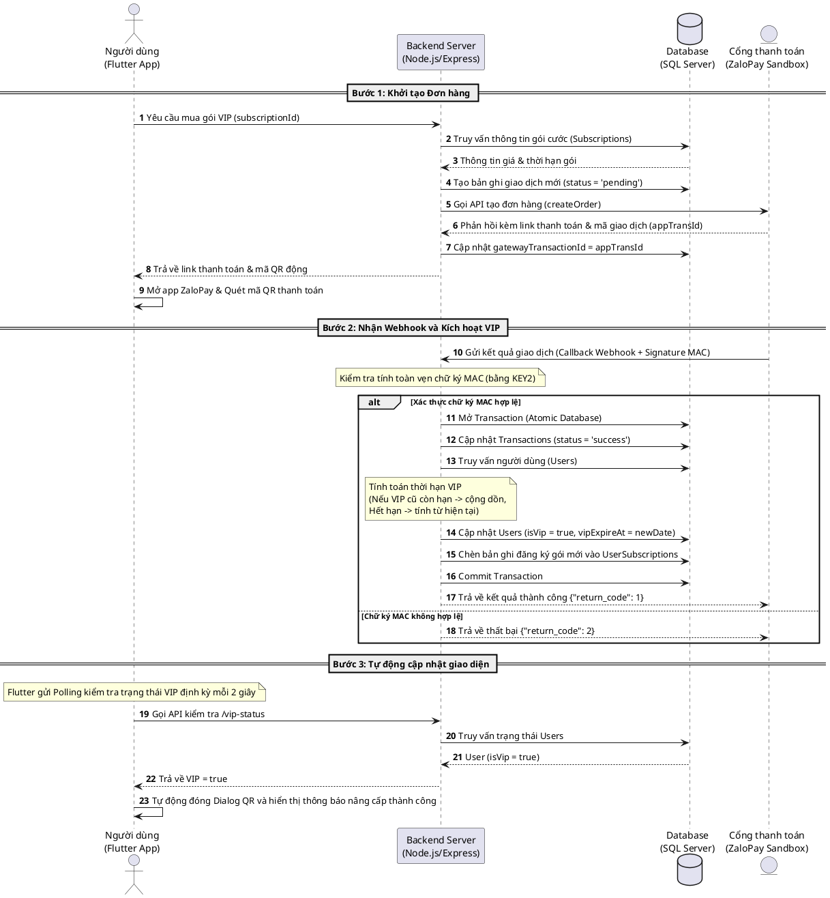

# BÁO CÁO KỸ THUẬT: TÍCH HỢP CỔNG THANH TOÁN ZALOPAY & CẬP NHẬT CƠ SỞ DỮ LIỆU

## 1. Luồng hoạt động tích hợp ZaloPay (Sequence Diagram)
Dưới đây là sơ đồ quy trình từ lúc người dùng khởi tạo thanh toán nâng cấp VIP trên ứng dụng Flutter, quét mã QR ZaloPay, hệ thống nhận callback webhook và tự động kích hoạt tài khoản VIP trên hệ thống.



---

## 2. Chi tiết cấu trúc Cơ sở dữ liệu liên quan

Hệ thống quản lý thanh toán và trạng thái VIP thông qua 4 bảng chính trong SQL Server:

### 2.1 Bảng `Users` (Người dùng)
Lưu trữ thông tin tài khoản và trạng thái VIP trực tiếp của người dùng.
*   `id` (INT, Primary Key): ID người dùng.
*   `username` (VARCHAR): Tên hiển thị.
*   `email` (VARCHAR): Email tài khoản.
*   `isVip` (BOOLEAN): Trạng thái tài khoản (`true` nếu là VIP, mặc định `false`).
*   `vipExpireAt` (DATETIME): Thời hạn hết hạn VIP (Null nếu chưa từng đăng ký).

### 2.2 Bảng `Subscriptions` (Gói cước VIP)
Lưu danh sách các gói dịch vụ VIP được cấu hình sẵn trên hệ thống.
*   `id` (INT, Primary Key): ID gói cước.
*   `name` (VARCHAR): Tên gói cước (ví dụ: "Gói VIP 1 Tháng").
*   `price` (DECIMAL): Số tiền của gói cước.
*   `durationDays` (INT): Số ngày sử dụng được cấp (ví dụ: 30 ngày).
*   `description` (VARCHAR): Mô tả gói.

### 2.3 Bảng `Transactions` (Nhật ký giao dịch thanh toán)
Lưu trữ lịch sử tất cả các yêu cầu thanh toán được khởi tạo qua cổng thanh toán.
*   `id` (INT, Primary Key): ID giao dịch tự tăng.
*   `userId` (INT, Foreign Key): Liên kết tới `Users.id`.
*   `amount` (DECIMAL): Số tiền giao dịch.
*   `paymentGateway` (VARCHAR): Cổng thanh toán sử dụng (`zalopay` hoặc `momo`).
*   `gatewayTransactionId` (VARCHAR): Mã giao dịch của cổng thanh toán (dùng để đối soát callback).
*   `status` (VARCHAR): Trạng thái giao dịch (`pending`, `success`, `failed`).

### 2.4 Bảng `UserSubscriptions` (Lịch sử đăng ký gói cước)
Ghi nhận nhật ký chi tiết các gói cước VIP người dùng đã từng mua thành công (phục vụ đối soát và báo cáo thống kê).
*   `id` (INT, Primary Key): ID bản ghi.
*   `userId` (INT, Foreign Key): Liên kết tới `Users.id`.
*   `subscriptionId` (INT, Foreign Key): Liên kết tới `Subscriptions.id`.
*   `startDate` (DATETIME): Ngày bắt đầu kích hoạt gói.
*   `endDate` (DATETIME): Ngày hết hạn gói.
*   `status` (VARCHAR): Trạng thái gói (`active`, `expired`).

---

## 3. Các thay đổi và Cập nhật dữ liệu (Database Updates)

Các bước thay đổi trạng thái của dữ liệu trong cơ sở dữ liệu diễn ra theo trình tự nghiêm ngặt, bọc trong một **Database Transaction** để đảm bảo tính nhất quán (ACID):

### Bước 1: Khi khởi tạo yêu cầu thanh toán (API `/payments/create`)
Hệ thống thêm mới một bản ghi giao dịch ghi nhận số tiền và cổng thanh toán:
```sql
-- Tạo bản ghi giao dịch tạm thời ở trạng thái chờ (pending)
INSERT INTO Transactions (userId, amount, paymentGateway, gatewayTransactionId, status)
VALUES (@userId, @price, 'zalopay', @tempOrderId, 'pending');

-- Sau khi gọi ZaloPay API thành công, cập nhật mã giao dịch chính xác (appTransId)
UPDATE Transactions 
SET gatewayTransactionId = @appTransId 
WHERE gatewayTransactionId = @tempOrderId;
```

### Bước 2: Khi nhận Webhook thanh toán thành công (ZaloPay Callback)
Khi ZaloPay gửi callback hợp lệ, Backend sẽ chạy các truy vấn cập nhật trong một Transaction:

1. **Cập nhật trạng thái giao dịch:**
   ```sql
   UPDATE Transactions 
   SET status = 'success' 
   WHERE gatewayTransactionId = @appTransId;
   ```

2. **Cập nhật thời hạn VIP của người dùng:**
   Hệ thống kiểm tra xem tài khoản đã là VIP và còn hạn hay không để tính toán `vipExpireAt` mới:
   *   *Trường hợp 1 (Còn hạn VIP cũ):* Cộng dồn số ngày của gói mới vào ngày hết hạn cũ:
       `vipExpireAt (mới) = vipExpireAt (cũ) + durationDays`
   *   *Trường hợp 2 (Chưa là VIP hoặc đã hết hạn):* Tính từ ngày thanh toán thành công hiện tại:
       `vipExpireAt (mới) = NOW() + durationDays`
   
   ```sql
   UPDATE Users 
   SET isVip = 1, vipExpireAt = @newVipExpireAt 
   WHERE id = @userId;
   ```

3. **Ghi nhận lịch sử đăng ký gói mới:**
   ```sql
   INSERT INTO UserSubscriptions (userId, subscriptionId, startDate, endDate, status)
   VALUES (@userId, @subscriptionId, GETDATE(), @newVipExpireAt, 'active');
   ```
