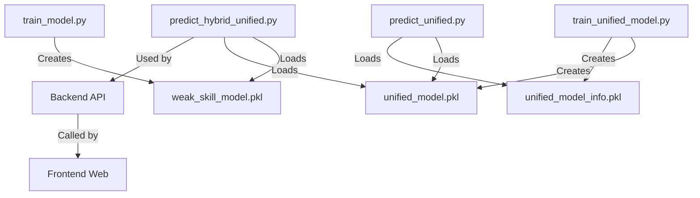

# 📊 3 FILES ML MODELS - ĐƯỢC SỬ DỤNG Ở ĐÂU?

> **Giải thích chi tiết cách 3 files .pkl được load và sử dụng**

---

## 📦 **3 FILES MODELS**

```
chatbot-toeic-backend/ml/
├── weak_skill_model.pkl          # Global Model
├── unified_model.pkl              # Unified Model  
└── unified_model_info.pkl         # Metadata của Unified Model
```

---

## 🔄 **WORKFLOW: TẠO RA VÀ SỬ DỤNG**



---

## 📝 **CHI TIẾT SỬ DỤNG**

### **1️⃣ weak_skill_model.pkl**

#### **Tạo bởi:**
```python
# File: train_model.py (line 101)
joblib.dump(model, "ml/weak_skill_model.pkl")
```

#### **Được load và sử dụng bởi:**

**A. predict_hybrid_unified.py** ⭐ (FILE CHÍNH CHO WEB)
```python
# Line 168-172
global_model_path = os.path.join(os.path.dirname(__file__), "weak_skill_model.pkl")

if not os.path.exists(global_model_path):
    raise FileNotFoundError("❌ Global model không tồn tại! Chạy train_model.py trước.")

global_model = joblib.load(global_model_path)  # Line 179
```

#### **Khi nào dùng:**
```python
# Line 194-215
if attempts < 10:  # User có ít data
    X_global = pd.DataFrame([[attempts, correct, accuracy]],
                           columns=['attempts', 'correct', 'accuracy'])
    y_pred = global_model.predict(X_global)[0]
    y_proba = global_model.predict_proba(X_global)[0]
    
    print(f"🤖 Model: GLOBAL (do attempts < 10)")
    # Predict weak skill...
```

**Tóm tắt:**
- ✅ Dùng cho **users mới** (<10 lần thử)
- ✅ Predict dựa trên: `attempts`, `correct`, `accuracy`
- ✅ Pattern học từ **tất cả users** trong DB

---

### **2️⃣ unified_model.pkl**

#### **Tạo bởi:**
```python
# File: train_unified_model.py (line 201-205)
model_path = os.path.join(os.path.dirname(__file__), "unified_model.pkl")
with open(model_path, 'wb') as f:
    pickle.dump(model, f)
    
print(f"✅ Model saved: {model_path}")
```

#### **Được load và sử dụng bởi:**

**A. predict_hybrid_unified.py** ⭐ (FILE CHÍNH CHO WEB)
```python
# Line 169-176
unified_model_path = os.path.join(os.path.dirname(__file__), "unified_model.pkl")

if not os.path.exists(unified_model_path):
    print("⚠️ Unified model chưa có, đang train...")
    from train_unified_model import train_unified_model
    train_unified_model()

unified_model = joblib.load(unified_model_path)  # Line 180
```

#### **Khi nào dùng:**
```python
# Line 218-242
else:  # attempts >= 10 (User có đủ data)
    X_unified = prepare_unified_features(userId, skillId, attempts, correct, accuracy, conn)
    y_pred = unified_model.predict(X_unified)[0]
    y_proba = unified_model.predict_proba(X_unified)[0]
    
    print(f"🤖 Model: UNIFIED (do attempts >= 10)")
    print(f"📊 User context:")
    print(f"   - User Level: {X_unified['user_level']}")
    print(f"   - Total Tests: {X_unified['total_tests']}")
    # Predict weak skill...
```

**B. predict_unified.py** (UTILITY - Testing only)
```python
# Line 69-78
model_path = os.path.join(os.path.dirname(__file__), "unified_model.pkl")
model = joblib.load(model_path)

# Test standalone unified model
```

**Tóm tắt:**
- ✅ Dùng cho **users có data** (≥10 lần thử)
- ✅ Predict dựa trên: `userId`, `skillId`, `attempts`, `correct`, `accuracy`, `user_level`, `total_tests`, `overall_accuracy`, `days_active`
- ✅ **Personalized** - học từ context của user cụ thể

---

### **3️⃣ unified_model_info.pkl**

#### **Tạo bởi:**
```python
# File: train_unified_model.py (line 213-218)
info_path = os.path.join(os.path.dirname(__file__), "unified_model_info.pkl")
with open(info_path, 'wb') as f:
    pickle.dump(model_info, f)

print(f"📊 Model info saved: {info_path}")
```

**Nội dung:**
```python
model_info = {
    'features': ['userId', 'skillId', 'attempts', ...],
    'accuracy': 0.95,
    'training_time': '2025-10-27 10:30:00',
    'num_samples': 1500,
    'feature_importance': {...}
}
```

#### **Được load và sử dụng bởi:**

**A. predict_unified.py** (UTILITY - Testing only)
```python
# Line 70-78
info_path = os.path.join(os.path.dirname(__file__), "unified_model_info.pkl")
with open(info_path, 'rb') as f:
    model_info = pickle.load(f)

print(f"📋 Model Info:")
print(f"   Features: {model_info['features']}")
print(f"   Accuracy: {model_info['accuracy']}")
```

**Tóm tắt:**
- ✅ Chứa **metadata** của unified model
- ✅ Không dùng cho prediction
- ✅ Chỉ dùng để **debug/kiểm tra** thông tin model

---

## 🎯 **PRODUCTION USAGE (WEB)**

### **File chính được gọi từ web:**

```javascript
// Backend: src/controllers/ml_recommendation_controller.js

const pythonProcess = spawn('python', [
    'ml/predict_hybrid_unified.py',  // ← FILE NÀY
    userId.toString()
]);
```

### **Trong predict_hybrid_unified.py:**

```python
def predict_hybrid_unified(userId: int):
    # 1. Load cả 2 models
    global_model = joblib.load("weak_skill_model.pkl")     # ← MODEL 1
    unified_model = joblib.load("unified_model.pkl")       # ← MODEL 2
    
    # 2. For each skill của user:
    for skill in user_skills:
        if skill.attempts < 10:
            # Dùng GLOBAL MODEL
            prediction = global_model.predict(...)
        else:
            # Dùng UNIFIED MODEL
            prediction = unified_model.predict(...)
    
    # 3. Return JSON
    return {
        "userId": userId,
        "weakSkills": [...],
        "recommendations": [...]
    }
```

---

## 📊 **SUMMARY TABLE**

| File | Tạo bởi | Dùng bởi | Mục đích | Khi nào load |
|------|---------|----------|----------|--------------|
| **weak_skill_model.pkl** | `train_model.py` | `predict_hybrid_unified.py` ⭐ | Predict cho users mới | Mỗi khi web gọi API |
| **unified_model.pkl** | `train_unified_model.py` | `predict_hybrid_unified.py` ⭐<br>`predict_unified.py` (test) | Predict cho users có data | Mỗi khi web gọi API |
| **unified_model_info.pkl** | `train_unified_model.py` | `predict_unified.py` (test) | Metadata/debug | Chỉ khi test |

---

## 🔄 **FULL WORKFLOW: TỪ TRAIN ĐẾN WEB**

```
┌─────────────────────────────────────────────────────────────┐
│ 1. TRAINING (Offline - mỗi tuần/tháng)                      │
└─────────────────────────────────────────────────────────────┘
    │
    ├─> python train_model.py
    │   └─> Creates: weak_skill_model.pkl
    │
    └─> python train_unified_model.py
        ├─> Creates: unified_model.pkl
        └─> Creates: unified_model_info.pkl

┌─────────────────────────────────────────────────────────────┐
│ 2. WEB REQUEST (Online - mỗi khi user access)               │
└─────────────────────────────────────────────────────────────┘
    │
    ├─> User vào trang web
    │
    ├─> Frontend: GET /api/ml/recommend/3
    │
    ├─> Backend Controller: spawn Python
    │   └─> python predict_hybrid_unified.py 3
    │
    ├─> predict_hybrid_unified.py:
    │   ├─> Load: weak_skill_model.pkl      ← FILE 1
    │   ├─> Load: unified_model.pkl         ← FILE 2
    │   │
    │   ├─> For each skill:
    │   │   ├─> If attempts < 10:
    │   │   │   └─> Use weak_skill_model.pkl
    │   │   └─> Else:
    │   │       └─> Use unified_model.pkl
    │   │
    │   └─> Return JSON
    │
    ├─> Backend → Frontend
    │
    └─> Frontend: Display UI
        ├─> Weak Skills
        └─> Recommended Questions
```

---

## 💡 **KEY POINTS**

### **Về weak_skill_model.pkl:**
- ✅ Load **mỗi khi** API được gọi
- ✅ Dùng cho users có **< 10 attempts**
- ✅ Pattern từ **tất cả users**
- ✅ Features: `attempts`, `correct`, `accuracy` (3 features)

### **Về unified_model.pkl:**
- ✅ Load **mỗi khi** API được gọi
- ✅ Dùng cho users có **≥ 10 attempts**
- ✅ **Personalized** - context của user cụ thể
- ✅ Features: `userId`, `skillId`, `user_level`, `total_tests`, ... (9 features)

### **Về unified_model_info.pkl:**
- ⚠️ **KHÔNG dùng trong production web**
- ⚠️ Chỉ load khi **testing/debugging**
- ⚠️ Chứa metadata của model

---

## 🚀 **CÁC FILES QUAN TRỌNG TRONG HỆ THỐNG**

### **Production (Dùng trên web):**
```
ml/
├── predict_hybrid_unified.py      ⭐⭐⭐ Main file cho web
├── weak_skill_model.pkl           ⭐⭐ Loaded by predict_hybrid_unified.py
└── unified_model.pkl              ⭐⭐ Loaded by predict_hybrid_unified.py
```

### **Training (Chạy offline):**
```
ml/
├── train_model.py                 ⭐ Creates weak_skill_model.pkl
└── train_unified_model.py         ⭐ Creates unified_model.pkl + unified_model_info.pkl
```

### **Testing/Debug (Không dùng trên web):**
```
ml/
├── predict_unified.py             Uses unified_model.pkl + unified_model_info.pkl
├── check_user_skills.py
└── find_best_user.py
```

---

## ✅ **TÓM TẮT NHANH**

**Q: 3 files .pkl được load ở đâu?**

**A:**
1. **weak_skill_model.pkl** → Load trong `predict_hybrid_unified.py` (line 179)
2. **unified_model.pkl** → Load trong `predict_hybrid_unified.py` (line 180) + `predict_unified.py` (line 71)
3. **unified_model_info.pkl** → Load trong `predict_unified.py` (line 72) - chỉ để test

**Q: File nào chạy trên web?**

**A:** Chỉ có **`predict_hybrid_unified.py`** - File này load cả 2 models (weak_skill + unified) và tự động chọn model phù hợp.

**Q: File nào quan trọng nhất?**

**A:**
- **Production:** `predict_hybrid_unified.py` ⭐⭐⭐
- **Models:** `weak_skill_model.pkl` + `unified_model.pkl` ⭐⭐
- **Metadata:** `unified_model_info.pkl` (không quan trọng cho web)

---

**Last Updated:** October 27, 2025  
**Verified:** ✅ All files checked with grep_search
