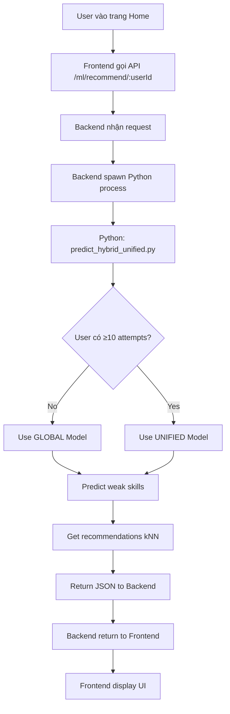

# 🤖 HƯỚNG DẪN TÍCH HỢP ML VÀO WEB - CHATBOT TOEIC

> **Hướng dẫn chi tiết cách sử dụng ML models để gợi ý câu hỏi cho users**

---

## 📋 **MỤC LỤC**

1. [Files ML quan trọng](#files-ml-quan-trọng)
2. [Workflow tổng quan](#workflow-tổng-quan)
3. [Setup Backend API](#setup-backend-api)
4. [Setup Frontend](#setup-frontend)
5. [Cách sử dụng trong code](#cách-sử-dụng-trong-code)
6. [Testing](#testing)
7. [Deployment](#deployment)

---

## 🎯 **FILES ML QUAN TRỌNG**

### **📊 1. Training Files (Chạy định kỳ)**

```bash
chatbot-toeic-backend/ml/
├── train_model.py              ⭐ Train Global Model
└── train_unified_model.py      ⭐ Train Unified Model
```

**Khi nào train:**
- Lần đầu setup hệ thống
- Mỗi tuần/tháng để cập nhật với data mới
- Khi có nhiều users mới
- Khi performance model giảm

**Cách train:**
```bash
cd chatbot-toeic-backend/ml

# Train Global Model (cho users < 10 attempts)
python train_model.py
# Output: weak_skill_model.pkl

# Train Unified Model (cho users ≥ 10 attempts)  
python train_unified_model.py
# Output: unified_model.pkl, unified_model_info.pkl
```

---

### **🚀 2. Production File (Dùng cho web)**

```bash
chatbot-toeic-backend/ml/
└── predict_hybrid_unified.py   ⭐⭐⭐ FILE CHÍNH CHO WEB
```

**Chức năng:**
- Phát hiện weak skills của user
- Gợi ý câu hỏi phù hợp
- Tự động chọn model (Global hoặc Unified) dựa trên số lần làm bài

**Usage:**
```bash
# Predict cho userId = 3
python predict_hybrid_unified.py 3

# Output (JSON):
{
    "userId": 3,
    "totalSkills": 7,
    "weakSkills": [
        {
            "skillId": 1,
            "skillName": "Vocabulary",
            "accuracy": 10.5,
            "attempts": 57,
            "correct": 6,
            "status": "WEAK",
            "modelUsed": "UNIFIED"
        }
    ],
    "recommendations": [
        {
            "questionId": 123,
            "question": "Choose the correct word...",
            "skillId": 1,
            "partId": 5,
            "typeId": 1
        }
    ],
    "strategy": "Hybrid (Global + Unified)"
}
```

---

### **🧪 3. Utility Files (Debug/Testing)**

```bash
chatbot-toeic-backend/ml/
├── check_user_skills.py           # Check skills của 1 user
├── check_skills_distribution.py   # Check all skills trong DB
└── find_best_user.py              # Tìm user để test
```

**Không dùng trong production web!**

---

## 🔄 **WORKFLOW TỔNG QUAN**



---

## 🔧 **SETUP BACKEND API**

### **Bước 1: Files đã tạo sẵn**

✅ Tôi đã tạo các files sau:

```
chatbot-toeic-backend/src/
├── controllers/
│   └── ml_recommendation_controller.js  ✅ Controller xử lý ML
└── routes/
    └── ml_router.js                     ✅ Routes cho ML API
```

### **Bước 2: Import vào api.js**

✅ **Đã cập nhật** `src/routes/api.js`:

```javascript
import mlRouter from './ml_router.js';

router.use('/ml', mlRouter);
```

### **Bước 3: Restart Backend**

```bash
cd chatbot-toeic-backend
npm run dev
```

### **API Endpoints**

#### **1. Get Recommendations**
```http
GET /api/ml/recommend/:userId
Authorization: Cookie (JWT)

Response:
{
    "code": 200,
    "message": "Recommendations retrieved successfully",
    "data": {
        "userId": 3,
        "weakSkills": [...],
        "recommendations": [...]
    }
}
```

#### **2. Retrain Models (Admin only)**
```http
POST /api/ml/retrain
Authorization: Cookie (JWT)

Response:
{
    "code": 200,
    "message": "Models retrained successfully"
}
```

---

## 🎨 **SETUP FRONTEND**

### **Files đã tạo sẵn**

✅ Tôi đã tạo các files sau:

```
chatbot-toeic-frontend/src/
├── services/
│   └── mlRecommendation_services.ts    ✅ API calls
├── components/
│   └── MLRecommendations.tsx           ✅ UI component
└── styles/
    └── MLRecommendations.css           ✅ Styles
```

---

## 💻 **CÁCH SỬ DỤNG TRONG CODE**

### **Option 1: Thêm vào Home Page**

```tsx
// File: src/pages/Home.tsx hoặc src/container/Home.tsx

import MLRecommendations from '../components/MLRecommendations';
import Cookies from 'js-cookie';

function Home() {
    const userId = Cookies.get('userId'); // Lấy từ cookie

    return (
        <div className="home-page">
            {/* Existing content */}
            
            {/* ML Recommendations Section */}
            {userId && (
                <div className="recommendations-container">
                    <MLRecommendations userId={parseInt(userId)} />
                </div>
            )}
        </div>
    );
}
```

### **Option 2: Tạo trang riêng**

```tsx
// File: src/pages/RecommendationsPage.tsx

import React from 'react';
import MLRecommendations from '../components/MLRecommendations';
import Cookies from 'js-cookie';

const RecommendationsPage: React.FC = () => {
    const userId = Cookies.get('userId');

    if (!userId) {
        return (
            <div className="error-page">
                <h2>Vui lòng đăng nhập</h2>
            </div>
        );
    }

    return (
        <div className="recommendations-page">
            <MLRecommendations userId={parseInt(userId)} />
        </div>
    );
};

export default RecommendationsPage;
```

**Thêm route:**
```tsx
// File: src/App.tsx hoặc routing file

import RecommendationsPage from './pages/RecommendationsPage';

<Routes>
    {/* Existing routes */}
    <Route path="/recommendations" element={<RecommendationsPage />} />
</Routes>
```

### **Option 3: API call đơn giản (không dùng component)**

```tsx
import { getMLRecommendationsAPI } from '../services/mlRecommendation_services';

// Trong component
const fetchRecommendations = async () => {
    try {
        const response = await getMLRecommendationsAPI(userId);
        
        if (response.code === 200) {
            console.log('Weak skills:', response.data.weakSkills);
            console.log('Recommendations:', response.data.recommendations);
            
            // Xử lý data theo ý bạn
            setWeakSkills(response.data.weakSkills);
            setQuestions(response.data.recommendations);
        }
    } catch (error) {
        console.error('Error:', error);
    }
};
```

---

## 🧪 **TESTING**

### **Test Backend API (Postman/cURL)**

```bash
# 1. Login để lấy cookie
curl -X POST http://localhost:8080/api/auth/login \
  -H "Content-Type: application/json" \
  -d '{"email": "user@example.com", "password": "password"}' \
  -c cookies.txt

# 2. Get recommendations
curl -X GET http://localhost:8080/api/ml/recommend/3 \
  -b cookies.txt

# Expected output:
# {
#   "code": 200,
#   "message": "Recommendations retrieved successfully",
#   "data": { ... }
# }
```

### **Test Python Script trực tiếp**

```bash
cd chatbot-toeic-backend/ml

# Test với user có data
python predict_hybrid_unified.py 3

# Check output có:
# - List weak skills
# - List recommended questions
# - JSON format
```

### **Test Frontend Component**

```bash
cd chatbot-toeic-frontend
npm run dev

# Navigate to:
# http://localhost:5173/recommendations

# Kiểm tra:
# ✅ Hiển thị weak skills
# ✅ Hiển thị recommended questions
# ✅ Click chọn skill → filter questions
# ✅ Loading state
# ✅ Error handling
```

---

## 📦 **DEPLOYMENT**

### **1. Đảm bảo Python installed trên server**

```bash
# Check Python version (cần ≥ 3.8)
python --version

# Install dependencies
pip install scikit-learn pandas numpy pyodbc
```

### **2. Train models trên server**

```bash
cd /path/to/chatbot-toeic-backend/ml

# Train models
python train_model.py
python train_unified_model.py

# Check .pkl files created
ls -la *.pkl
# Expected:
# - weak_skill_model.pkl
# - unified_model.pkl
# - unified_model_info.pkl
```

### **3. Setup cron job để auto-retrain**

**Linux/Mac:**
```bash
# Edit crontab
crontab -e

# Add line (retrain every Sunday 2:00 AM)
0 2 * * 0 cd /path/to/ml && python train_model.py && python train_unified_model.py
```

**Windows (Task Scheduler):**
```powershell
# Create scheduled task
$action = New-ScheduledTaskAction -Execute 'python' -Argument 'train_model.py' -WorkingDirectory 'C:\path\to\ml'
$trigger = New-ScheduledTaskTrigger -Weekly -DaysOfWeek Sunday -At 2am
Register-ScheduledTask -Action $action -Trigger $trigger -TaskName "RetrainMLModels"
```

**Node.js (Alternative):**
```javascript
// File: src/config.js hoặc server.js
import cron from 'node-cron';
import { exec } from 'child_process';

// Retrain every Sunday at 2:00 AM
cron.schedule('0 2 * * 0', () => {
    console.log('Starting ML model retraining...');
    
    exec('cd ml && python train_model.py', (err1) => {
        if (err1) console.error('Error training global model:', err1);
        
        exec('cd ml && python train_unified_model.py', (err2) => {
            if (err2) console.error('Error training unified model:', err2);
            else console.log('ML models retrained successfully!');
        });
    });
});
```

### **4. Environment Variables**

```bash
# Backend .env
PYTHON_PATH=/usr/bin/python3  # Path to Python (optional)
ML_SCRIPT_PATH=./ml           # Path to ML scripts (optional)
```

### **5. Docker Deployment**

```dockerfile
# Dockerfile (Backend)
FROM node:18

# Install Python
RUN apt-get update && apt-get install -y python3 python3-pip

# Install Python dependencies
COPY ml/requirements.txt /app/ml/
RUN pip3 install -r /app/ml/requirements.txt

# Copy app
COPY . /app
WORKDIR /app

# Train models on build
RUN cd ml && python3 train_model.py && python3 train_unified_model.py

# Start server
CMD ["npm", "start"]
```

---

## 🎯 **CHECKLIST TÍCH HỢP**

### **Backend ✅**
- [x] Files `ml_recommendation_controller.js` created
- [x] Files `ml_router.js` created
- [x] Import router vào `api.js`
- [x] Test API endpoint với Postman
- [x] Python scripts hoạt động

### **Frontend ✅**
- [x] Service `mlRecommendation_services.ts` created
- [x] Component `MLRecommendations.tsx` created
- [x] Styles `MLRecommendations.css` created
- [ ] Thêm component vào page (Home hoặc trang riêng)
- [ ] Add route nếu tạo trang riêng
- [ ] Test UI hiển thị đúng

### **ML ✅**
- [x] File `predict_hybrid_unified.py` tồn tại
- [x] Models `.pkl` đã được train
- [ ] Test Python script trực tiếp
- [ ] Setup cron job auto-retrain (production)

### **Deployment 🔄**
- [ ] Python installed trên server
- [ ] ML dependencies installed (scikit-learn, pandas, numpy, pyodbc)
- [ ] Models trained trên server
- [ ] Cron job setup (optional)
- [ ] Test API endpoint trên production

---

## 🚀 **NEXT STEPS**

### **1. Tích hợp vào Home Page (Khuyến nghị)**

```tsx
// Thêm section vào Home.tsx
<section className="recommendations-section">
    <h2>📊 Kỹ Năng Của Bạn</h2>
    <MLRecommendations userId={currentUserId} />
</section>
```

### **2. Hoặc tạo trang riêng**

```tsx
// Tạo route mới
<Route path="/my-skills" element={<RecommendationsPage />} />

// Add link trong navbar
<Link to="/my-skills">Phân Tích Kỹ Năng</Link>
```

### **3. Customize UI**

- Thay đổi colors trong `MLRecommendations.css`
- Thêm animations
- Thêm charts (Chart.js)
- Integration với test page (click "Luyện tập" → redirect to test)

### **4. Advanced Features**

- [ ] Export recommendations to PDF
- [ ] Share recommendations với bạn bè
- [ ] Track progress over time
- [ ] Email weekly recommendations
- [ ] Push notifications cho weak skills

---

## 📞 **SUPPORT**

**Questions?** 
- Check `ml/ML_FILES_README.md` cho ML details
- Check `SYSTEM_OVERVIEW.md` cho architecture
- Check Python script comments cho logic

**Errors?**
- Check backend logs: `console.log` trong controller
- Check Python errors: Run script trực tiếp
- Check database connection: Test SQL queries

---

**Last Updated:** October 27, 2025  
**Status:** ✅ Ready to integrate  
**Files Created:** 6 files (Backend: 2, Frontend: 3, Docs: 1)

---

> **💡 Tip:** Bắt đầu bằng cách test API endpoint với Postman, sau đó thêm component vào Home page!
