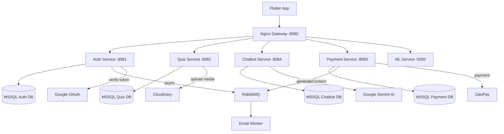
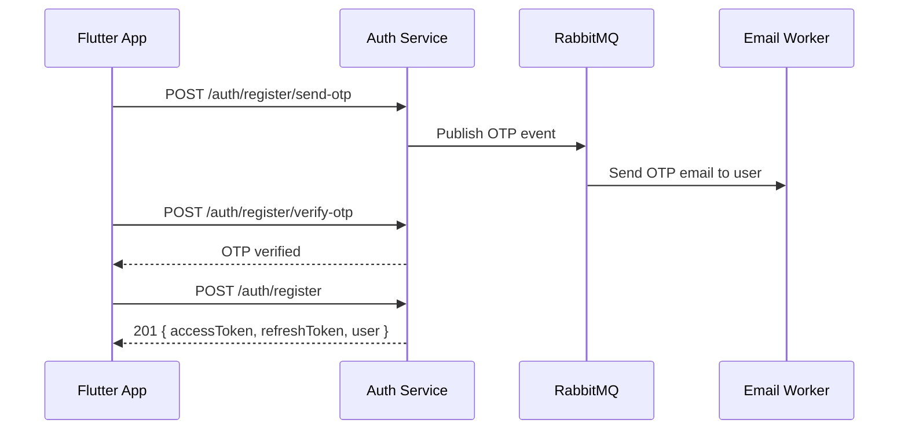
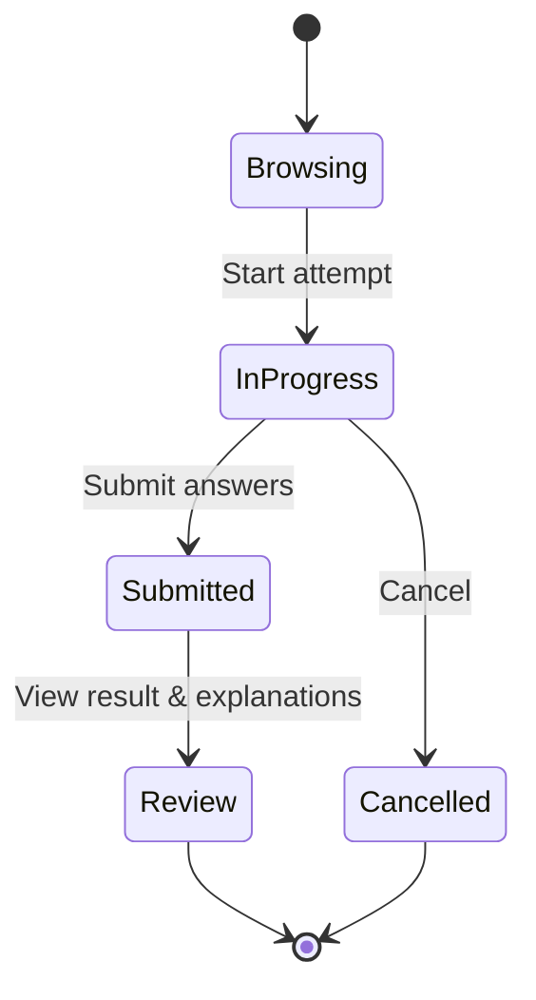
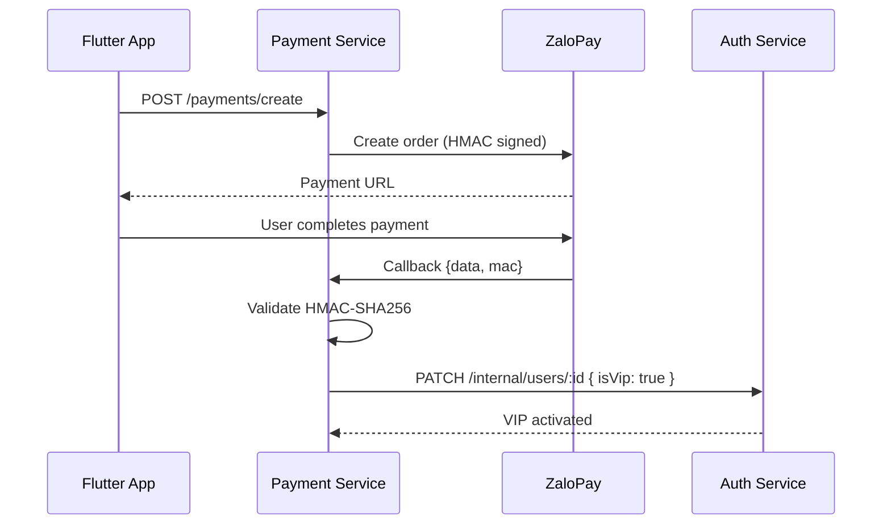

# PORTFOLIO SUMMARY — Chatbot TOEIC Platform
## Dự án Nổi Bật | Software Engineer & Backend Developer

> **Stack:** Node.js · Express · Microservices · Docker · SQL Server · Python ML · Flutter · Google Gemini AI · ZaloPay

---

## 1. Bối cảnh & Đặt vấn đề

### Bối cảnh

TOEIC (Test of English for International Communication) là chứng chỉ tiếng Anh quan trọng được hàng triệu người lao động và sinh viên tại Việt Nam theo đuổi mỗi năm. Tuy nhiên, phần lớn thí sinh gặp phải các vấn đề sau trong quá trình tự ôn luyện:

| Vấn đề | Mô tả |
|---|---|
| **Thiếu công cụ học tập thông minh** | Các nền tảng học TOEIC hiện tại chủ yếu cung cấp bài thi tĩnh, không có phản hồi cá nhân hóa |
| **Không biết điểm yếu của mình** | Người học khó xác định được Part nào họ cần cải thiện nhất |
| **Chi phí gia sư cao** | Việc được hướng dẫn 1-1 đòi hỏi chi phí lớn và không linh hoạt về thời gian |
| **Thiếu tính tương tác** | Thiếu công cụ hỏi đáp tức thời về ngữ pháp, từ vựng trong bối cảnh TOEIC |

### Đặt vấn đề

> *Làm thế nào để xây dựng một nền tảng luyện thi TOEIC toàn diện, có khả năng **cá nhân hóa lộ trình học**, **dự đoán điểm số**, và **tương tác thông minh như một gia sư AI**, với chi phí tiếp cận thấp?*

---

## 2. Mục tiêu & Phạm vi dự án

### Mục tiêu tổng thể

Xây dựng một hệ thống full-stack, production-ready phục vụ việc luyện thi TOEIC với 3 trụ cột:

```
+------------------+    +----------------------+    +-------------------+
|   PRACTICE       |    |   AI-POWERED         |    |   DATA-DRIVEN     |
|                  |    |                      |    |                   |
|  Full TOEIC test |    |  Chatbot Gemini AI   |    |  ML Score         |
|  engine with     |    |  for on-demand       |    |  Prediction &     |
|  auto-scoring    |    |  TOEIC tutoring      |    |  Weak Skill Reco  |
+------------------+    +----------------------+    +-------------------+
```

### Phạm vi kỹ thuật

| Phạm vi | Chi tiết |
|---|---|
| **Backend** | 5 microservices độc lập (Node.js/Express) + 1 ML service (Python Flask) |
| **Frontend** | Ứng dụng Flutter đa nền tảng (Android, iOS, Web) |
| **Cơ sở hạ tầng** | Docker Compose, Nginx API Gateway, SQL Server 2022 |
| **Tích hợp** | Google Gemini AI, ZaloPay Payment, Cloudinary Media, RabbitMQ Email |
| **ML Pipeline** | Thu thập dữ liệu → Train model → Auto-retrain → Serving REST API |

### Mục tiêu cụ thể (KPIs)

- [x] Hỗ trợ đầy đủ 7 Parts TOEIC (Listening Parts 1-4, Reading Parts 5-7)
- [x] Chấm điểm tự động sau mỗi lần nộp bài
- [x] Chatbot AI trả lời câu hỏi TOEIC trong vòng < 3 giây
- [x] Dự đoán điểm TOEIC dựa trên lịch sử làm bài
- [x] Tích hợp thanh toán ZaloPay cho gói VIP
- [x] Triển khai toàn bộ hệ thống qua Docker với 1 lệnh duy nhất
- [x] API Documentation đầy đủ qua Swagger UI

---

## 3. Trách nhiệm kỹ thuật cá nhân

> **Vai trò:** Software Engineer & Backend Developer (Lead Backend)

### 3.1 Thiết kế Kiến trúc Hệ thống

**Trách nhiệm:** Đề xuất và triển khai toàn bộ kiến trúc Microservices từ đầu.

- Phân tích yêu cầu nghiệp vụ và chia tách thành các bounded contexts độc lập
- Thiết kế service decomposition: Auth, Quiz, Chatbot, Payment, Email, ML
- Chọn pattern Database-per-Service để đảm bảo isolation giữa các service
- Thiết kế Nginx API Gateway routing cho toàn bộ hệ thống
- Quyết định communication pattern: REST (sync) + RabbitMQ (async for email)

### 3.2 Phát triển Auth Service

**Trách nhiệm:** Toàn bộ hệ thống xác thực và phân quyền.

- Implement JWT dual-token strategy (access token 7d + refresh token 30d)
- Tích hợp Google OAuth 2.0 cho đăng nhập bằng tài khoản Google
- Xây dựng luồng OTP qua email cho đăng ký và quên mật khẩu
- Thiết kế Role-Based Access Control (Admin / User)
- Implement VIP middleware kiểm tra giới hạn tin nhắn Chatbot theo ngày

### 3.3 Phát triển Quiz Service

**Trách nhiệm:** Engine chấm điểm và toàn bộ logic bài thi TOEIC.

- Thiết kế data model cho Tests, Questions, Parts, Skills, TestAttempts
- Implement thuật toán chấm điểm TOEIC theo từng Part
- Xây dựng lifecycle management cho attempt: start → in-progress → submitted/cancelled
- Tích hợp Cloudinary cho upload audio/image bài thi
- Xây dựng tính năng batch upload từ local path (Admin tool)
- Triển khai Swagger/OpenAPI 3 documentation cho toàn bộ API

### 3.4 Tích hợp AI Chatbot (Google Gemini)

**Trách nhiệm:** Toàn bộ module chatbot AI.

- Tích hợp Google Gemini 2.5 Flash qua REST API (không dùng SDK)
- Implement multi-turn conversation với context history từ database
- Xây dựng API key rotation (round-robin) để phân tán rate limit
- Thiết kế VIP gating logic: kiểm tra số tin nhắn trong ngày cross-service
- Lưu trữ toàn bộ conversation history theo user

### 3.5 Tích hợp ZaloPay Payment

**Trách nhiệm:** Toàn bộ module thanh toán.

- Implement ZaloPay Sandbox integration (tạo order, generate payment URL)
- Xây dựng webhook receiver với HMAC-SHA256 signature validation
- Logic kích hoạt VIP tự động sau khi nhận callback hợp lệ
- Thiết kế cumulative VIP expiry (cộng dồn, không ghi đè)
- Sử dụng ngrok để test webhook trong môi trường local

### 3.6 ML Pipeline Integration

**Trách nhiệm:** Tích hợp backend với ML service và cron jobs.

- Tích hợp Python Flask ML service vào hệ thống microservices
- Implement `mlRetrainCron.js`: auto-retrain model hàng ngày lúc 2:00 AM
- Implement `embeddingCron.js`: tự động tạo AI embeddings cho câu hỏi mới
- Xây dựng REST API proxy từ quiz-service đến ml-service

### 3.7 DevOps & Infrastructure

**Trách nhiệm:** Toàn bộ containerization và triển khai.

- Viết `Dockerfile` cho 5 Node.js services
- Cấu hình `docker-compose.yml` điều phối 9 containers
- Cấu hình `nginx.conf` routing theo path prefix cho từng service
- Viết MSSQL init script tự động tạo schema và seed data khi khởi động lần đầu
- Cấu hình Docker volumes cho database persistence

---

## 4. Kiến trúc Hệ thống Tổng thể

### 4.1 System Architecture Overview



### 4.2 Authentication Flow



### 4.3 TOEIC Test Lifecycle



### 4.4 Payment & VIP Activation Flow



---

## 5. Kết quả & Hiệu quả

### Technical Achievements

| Thành tựu | Chi tiết |
|---|---|
| **Scalable Architecture** | Mỗi service có thể scale độc lập; thêm instance mà không cần sửa code |
| **Zero-downtime Deployment** | Docker restart policy đảm bảo service tự phục hồi sau crash |
| **API Documentation** | 55+ endpoints có Swagger UI, ready for team onboarding |
| **Security** | Rate limiting, JWT, HMAC validation, CORS whitelist, security headers |
| **Async Processing** | Email gửi bất đồng bộ qua RabbitMQ, không block API response |
| **Auto ML Retrain** | Model tự cải thiện theo dữ liệu người dùng mới mà không cần can thiệp |
| **One-command Deploy** | `docker compose up -d --build` khởi động toàn bộ 9 containers |

### Skills Demonstrated

```
Backend Development:     ████████████████████  Node.js, Express, REST API Design
Database Design:         ████████████████      SQL Server, Sequelize ORM, DB-per-Service
Microservices:           ████████████████████  Service decomposition, inter-service comm
Authentication:          ████████████████████  JWT, OAuth 2.0, OTP, RBAC
Third-party Integration: ████████████████      Gemini AI, ZaloPay, Cloudinary, Google Auth
DevOps:                  ████████████          Docker, Docker Compose, Nginx
Machine Learning:        ████████              scikit-learn, Flask, auto-retrain pipeline
Message Queue:           ████████████          RabbitMQ, async event-driven patterns
API Documentation:       ████████████████████  Swagger/OpenAPI 3
```

---

**Prepared by:** Pham Tuan Hung
**Role:** Software Engineer & Backend Developer
**Contact:** phamtuanhung9a5@gmail.com
**Repository Branch:** SWE_BE3
**Date:** August 2026
