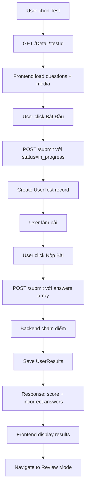
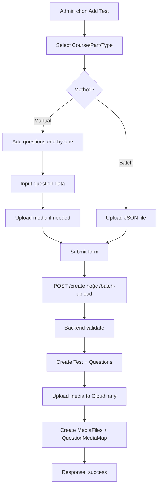
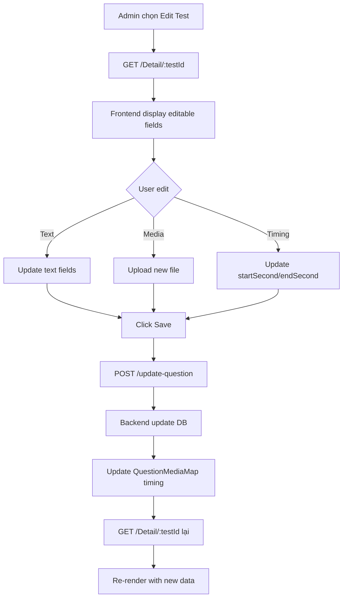

# 🧠 TÓM TẮT HỆ THỐNG CHATBOT TOEIC

> **Tài liệu tổng quan về kiến trúc, công nghệ và quy trình làm việc của hệ thống**

---

## 📋 **MỤC LỤC**

1. [Giới thiệu hệ thống](#giới-thiệu-hệ-thống)
2. [Kiến trúc hệ thống](#kiến-trúc-hệ-thống)
3. [Công nghệ sử dụng](#công-nghệ-sử-dụng)
4. [Cấu trúc thư mục](#cấu-trúc-thư-mục)
5. [Các tính năng chính](#các-tính-năng-chính)
6. [Database Schema](#database-schema)
7. [API Documentation](#api-documentation)
8. [Quy trình làm việc](#quy-trình-làm-việc)
9. [ML/AI Integration](#mlai-integration)
10. [Deployment](#deployment)

---

## 🎯 **GIỚI THIỆU HỆ THỐNG**

**Chatbot TOEIC** là một nền tảng web học TOEIC thông minh với:
- ✅ Làm bài thi TOEIC theo part/full test với giới hạn thời gian
- 🤖 AI Chatbot giải thích đáp án, phân tích câu hỏi, tra từ vựng
- 📊 ML Model gợi ý câu hỏi dựa trên weak skills của user
- 🎵 Hỗ trợ audio timing cho listening questions
- 👥 Phân quyền Admin/User với quản lý đầy đủ

**Demo:** https://hungptit.dev

---

## 🏗️ **KIẾN TRÚC HỆ THỐNG**

```
┌─────────────────────────────────────────────────────────────┐
│                      CHATBOT TOEIC SYSTEM                    │
└─────────────────────────────────────────────────────────────┘

┌──────────────────┐          ┌──────────────────┐
│    FRONTEND      │          │     BACKEND      │
│  React + TS      │ ◄─REST──►│  Node.js + JS    │
│  Port: 5173      │          │  Port: 8080      │
└──────────────────┘          └──────────────────┘
        │                              │
        │                              │
        ▼                              ▼
┌──────────────────┐          ┌──────────────────┐
│   CLOUDINARY     │          │   SQL SERVER     │
│  Media Storage   │          │    Database      │
└──────────────────┘          └──────────────────┘
                                       │
                                       ▼
                              ┌──────────────────┐
                              │   ML/AI LAYER    │
                              │  Python Scripts  │
                              └──────────────────┘
                                       │
                                       ▼
                              ┌──────────────────┐
                              │   GEMINI API     │
                              │  (Google AI)     │
                              └──────────────────┘
```

---

## 🛠️ **CÔNG NGHỆ SỬ DỤNG**

### **Frontend**
```json
{
  "framework": "React 19.1.0",
  "language": "TypeScript 5.8.3",
  "build": "Vite 7.0.0",
  "routing": "React Router DOM 7.6.3",
  "http": "Axios 1.10.0",
  "ui-libs": [
    "react-icons",
    "react-select",
    "sweetalert2",
    "chart.js",
    "react-chartjs-2"
  ],
  "auth": "@react-oauth/google",
  "markdown": "react-markdown"
}
```

### **Backend**
```json
{
  "runtime": "Node.js",
  "framework": "Express 5.1.0",
  "language": "JavaScript (ES Modules)",
  "database": "SQL Server (mssql 11.0.1)",
  "orm": "Sequelize 6.37.7",
  "ai": "@google/generative-ai 0.24.1",
  "storage": "Cloudinary 1.41.3",
  "auth": "JWT + bcrypt + cookie-parser",
  "media": "multer + ffprobe",
  "cron": "node-cron"
}
```

### **ML/AI**
```python
{
  "framework": "scikit-learn",
  "model_type": "RandomForestClassifier",
  "strategy": "Hybrid (Global + Unified)",
  "features": [
    "attempts", "correct", "accuracy",  # Global
    "userId", "skillId", "user_avg_accuracy",  # Unified
    "skill_complexity", "user_trend"
  ],
  "api": "Google Gemini API (chatbot)"
}
```

### **DevOps**
- **Container:** Docker + Docker Compose
- **Database:** SQL Server (local hoặc Azure)
- **Media CDN:** Cloudinary
- **Deployment:** Self-hosted / Cloud

---

## 📁 **CẤU TRÚC THƯ MỤC**

```
Chatbot_Toeic/
├── 📱 chatbot-toeic-frontend/      # React frontend
│   ├── src/
│   │   ├── components/             # Reusable UI components
│   │   ├── container/              # Page containers
│   │   ├── layouts/                # Layout wrappers
│   │   ├── pages/                  # Route pages
│   │   ├── services/               # API calls
│   │   ├── styles/                 # CSS files
│   │   └── hooks/                  # Custom hooks
│   ├── public/                     # Static assets
│   └── package.json
│
├── 🔧 chatbot-toeic-backend/       # Node.js backend
│   ├── src/
│   │   ├── config/                 # Database config
│   │   ├── controllers/            # Request handlers
│   │   ├── models/                 # Sequelize models
│   │   ├── routes/                 # API routes
│   │   ├── services/               # Business logic
│   │   ├── Middleware/             # Auth & validation
│   │   └── server.js               # Entry point
│   ├── ml/                         # Python ML scripts
│   │   ├── predict_hybrid_unified.py  # Production ML
│   │   ├── train_model.py          # Train global model
│   │   ├── train_unified_model.py  # Train unified model
│   │   └── *.pkl                   # Trained models
│   └── package.json
│
├── 📚 Documentation/                # Tài liệu
│   ├── SYSTEM_OVERVIEW.md          # File này
│   ├── TEST_WORKFLOW_GUIDE.md      # Quy trình làm test
│   ├── ADDTESTFORM_USER_GUIDE.md   # Hướng dẫn thêm test
│   ├── BATCH_UPLOAD_GUIDE.md       # Upload hàng loạt
│   ├── MEDIA_EDITING_DOCUMENTATION.md  # Edit media
│   └── ...
│
├── 🐳 docker-compose.yml            # Container orchestration
├── 📄 package.json                  # Root workspace config
└── 🖼️ img/                          # Screenshots
```

---

## ⚡ **CÁC TÍNH NĂNG CHÍNH**

### **1. 🧑‍🎓 Tính Năng User**

#### **A. Làm Bài Test**
- **Exam Mode:** 
  - Full test hoặc theo Part (1-7)
  - Đồng hồ đếm ngược
  - Audio timing cho listening (startSecond-endSecond)
  - Replay từng đoạn audio cụ thể
- **Submit Test:**
  - Tự động chấm điểm
  - Lưu kết quả vào UserResults
  - Hiển thị summary: correct/total, score
- **Review Mode:**
  - Xem lại đáp án đúng/sai
  - Explanation cho từng câu
  - Replay audio chính xác

#### **B. Chatbot AI**
- **Conversation-based:**
  - Lưu lịch sử chat trong database
  - Hỗ trợ multiple conversations
  - Context-aware responses
- **Capabilities:**
  - Giải thích ngữ pháp TOEIC
  - Phân tích đáp án chi tiết
  - Tra từ vựng (pronunciation, synonyms, antonyms)
  - Gợi ý học tập

#### **C. Vocabulary Lookup**
- Tra từ trong database
- AI fallback nếu không có trong DB
- Phát âm (IPA)
- Ví dụ câu, synonyms, antonyms
- Giải thích tiếng Việt

#### **D. Thống Kê & Lịch Sử**
- Lịch sử làm bài (UserTest)
- Chart điểm theo thời gian
- Phân tích weak skills
- Progress tracking

### **2. 👨‍💼 Tính Năng Admin**

#### **A. Quản Lý Test**
- **View/Edit Test:**
  - Xem chi tiết câu hỏi
  - Edit inline (text, options, correct answer)
  - Upload/replace media (image/audio)
  - Audio timing input
  - Save individual hoặc bulk update
- **Add New Test:**
  - Select Course, Part, Type
  - Add questions manually
  - Upload JSON batch (reading/listening/mixed)
  - Auto-format Windows paths
- **Batch Operations:**
  - Import từ JSON file
  - Support mixed tests (reading + listening)
  - Auto-detect question types

#### **B. Quản Lý User**
- Danh sách users
- Edit role (user/admin)
- Ban/unban account
- View user statistics

#### **C. Quản Lý Course**
- Add/edit courses
- Manage Parts (1-7)
- Question Types
- Skills taxonomy

---

## 🗄️ **DATABASE SCHEMA**

### **Core Tables**

```sql
-- Users
Users (id, username, email, password, role, isActive, createdAt)

-- Courses & Tests
Courses (id, name, description, level)
Tests (id, title, courseId, participants, createdAt)
TestQuestion (testId, questionId, sortOrder)

-- Questions
Questions (id, question, optionA-D, correctAnswer, explanation, typeId, partId)
QuestionType (id, name)
Part (id, name, description)
QuestionSkills (questionId, skillId)

-- Media
MediaFiles (id, mediaType, mediaUrl, description, duration)
QuestionMediaMap (id, questionId, mediaId, startSecond, endSecond, sortOrder)

-- User Progress
UserTest (id, userId, testId, status, startedAt, completedAt, score)
UserResults (id, userId, userTestId, questionId, selectedOption, isCorrect, answeredAt)

-- Vocabulary
Vocabulary (id, word, definition, example)
Pronunciations (id, wordId, ipa)
meaning (id, wordId, definition, pos)
synonym (wordId, synonymWord)
antonym (wordId, antonymWord)
UserVocabulary (userId, wordId, status, reviewCount)

-- Chatbot
Conversation (id, userId, title, createdAt)
Message (id, conversationId, role, content, createdAt)
```

### **Key Relationships**
- `Tests` → `Questions` (Many-to-Many via `TestQuestion`)
- `Questions` → `MediaFiles` (Many-to-Many via `QuestionMediaMap`)
- `Users` → `Tests` → `UserResults` (Test history)
- `Users` → `Conversations` → `Messages` (Chat history)

---

## 🔌 **API DOCUMENTATION**

### **Base URL:** `http://localhost:8080/api`

### **Auth Endpoints**
```
POST   /auth/signup           # Đăng ký
POST   /auth/login            # Đăng nhập (JWT + cookie)
GET    /auth/logout           # Đăng xuất
GET    /auth/verify           # Verify token
```

### **Test Endpoints**
```
GET    /questionTest/Detail/:testId        # Get questions for test
POST   /questionTest/submit                # Submit test answers
GET    /questionTest/review/:userTestId    # Review mode data
POST   /questionTest/create                # Add new test
POST   /questionTest/update-question       # Update question
POST   /questionTest/batch-upload          # Batch upload JSON
```

### **Chatbot Endpoints**
```
GET    /conversation                       # Get all conversations
POST   /conversation                       # Create conversation
GET    /conversation/:id/messages          # Get messages
POST   /message                            # Send message
DELETE /conversation/:id                   # Delete conversation
```

### **Admin Endpoints**
```
GET    /admin/users                        # List users
PUT    /admin/users/:id                    # Update user
GET    /admin/tests                        # List tests
DELETE /admin/tests/:id                    # Delete test
```

### **Vocabulary Endpoints**
```
GET    /vocabulary/search?word=...         # Search word
POST   /vocabulary/lookup                  # AI lookup
```

---

## 🔄 **QUY TRÌNH LÀM VIỆC**

### **Quy Trình Làm Test (User)**



**Chi tiết:** Xem `TEST_WORKFLOW_GUIDE.md`

### **Quy Trình Add Test (Admin)**



**Chi tiết:** Xem `ADDTESTFORM_USER_GUIDE.md`, `BATCH_UPLOAD_GUIDE.md`

### **Quy Trình Edit Test (Admin)**



**Chi tiết:** Xem `MEDIA_EDITING_DOCUMENTATION.md`

---

## 🤖 **ML/AI INTEGRATION**

### **Machine Learning Layer**

#### **A. Weak Skill Detection**

**Mục đích:** Phát hiện kỹ năng yếu của user để gợi ý câu hỏi phù hợp

**Strategy:** Hybrid Approach
```python
if user_attempts < 10:
    use GLOBAL MODEL (weak_skill_model.pkl)
else:
    use UNIFIED MODEL (unified_model.pkl)
```

**Models:**
1. **Global Model** (`weak_skill_model.pkl`)
   - Train trên data tất cả users
   - Features: attempts, correct, accuracy (3 features)
   - Use case: Users mới (<10 attempts)
   - Output: Weak skill predictions

2. **Unified Model** (`unified_model.pkl`)
   - Train trên data tất cả users với user context
   - Features: userId, skillId, user_avg_accuracy, skill_complexity, user_trend (9 features)
   - Use case: Users có đủ data (≥10 attempts)
   - Output: Personalized weak skill predictions

**Production File:** `ml/predict_hybrid_unified.py`

**Workflow:**
```bash
# Predict weak skills
python predict_hybrid_unified.py <userId>

# Output:
# - List of weak skills (accuracy < 50%)
# - Recommended questions (kNN + filtering)
# - Model used (Global vs Unified)
```

#### **B. Question Recommendation**

**Algorithm:** k-Nearest Neighbors (kNN)
```python
# 1. Get weak skills
weak_skills = predict_weak_skills(userId)

# 2. For each weak skill:
questions = db.query("""
    SELECT * FROM Questions q
    JOIN QuestionSkills qs ON q.id = qs.questionId
    WHERE qs.skillId = :weakSkillId
    AND q.id NOT IN (
        SELECT questionId FROM UserResults WHERE userId = :userId
    )
    LIMIT 10
""")

# 3. Return recommendations
```

#### **C. Model Training**

**Scheduled Retrain:** Mỗi tuần (Sunday 2:00 AM)
```javascript
// Backend: src/config.js hoặc server.js
const cron = require('node-cron');

cron.schedule('0 2 * * 0', () => {
    console.log('Retraining ML models...');
    exec('python ml/train_model.py');
    exec('python ml/train_unified_model.py');
});
```

**Manual Retrain:**
```bash
cd chatbot-toeic-backend/ml
python train_model.py           # Global model
python train_unified_model.py   # Unified model
```

### **AI Chatbot**

**Provider:** Google Gemini API

**Integration:**
```javascript
// Backend: src/services/message_service.js
import { GoogleGenerativeAI } from '@google/generative-ai';

const genAI = new GoogleGenerativeAI(process.env.GEMINI_API_KEY);
const model = genAI.getGenerativeModel({ model: 'gemini-1.5-flash' });

async function sendMessageToGemini(conversationHistory) {
    const chat = model.startChat({
        history: conversationHistory, // [{ role: 'user', parts: [{ text }] }]
    });
    const result = await chat.sendMessage(newMessage);
    return result.response.text();
}
```

**Capabilities:**
- Giải thích ngữ pháp TOEIC
- Phân tích đáp án chi tiết
- Tra từ vựng với context
- Gợi ý học tập
- Conversation context-aware

**Cost Control:**
- Rate limiting per user
- Token limit per request
- Fallback to database first

---

## 🚀 **DEPLOYMENT**

### **Docker Deployment**

#### **1. Docker Compose Structure**
```yaml
version: '3.8'

services:
  # Frontend
  frontend:
    build: ./chatbot-toeic-frontend
    ports:
      - "5173:5173"
    environment:
      - VITE_API_URL=http://localhost:8080
    depends_on:
      - backend

  # Backend
  backend:
    build: ./chatbot-toeic-backend
    ports:
      - "8080:8080"
    environment:
      - DB_SERVER=${DB_SERVER}
      - DB_USERNAME=${DB_USERNAME}
      - DB_PASS=${DB_PASS}
      - GEMINI_API_KEY=${GEMINI_API_KEY}
      - CLOUDINARY_CLOUD_NAME=${CLOUDINARY_CLOUD_NAME}
    depends_on:
      - database

  # Database (optional)
  database:
    image: mcr.microsoft.com/mssql/server:2022-latest
    environment:
      - ACCEPT_EULA=Y
      - SA_PASSWORD=${DB_PASS}
    ports:
      - "1433:1433"
    volumes:
      - mssql-data:/var/opt/mssql
```

#### **2. Build & Run**
```bash
# Clone project
git clone https://github.com/hungpptit/chatbot-toeic.git
cd chatbot-toeic

# Create .env file
cat > .env << EOF
DB_SERVER=database
DB_USERNAME=sa
DB_PASS=YourPassword123
GEMINI_API_KEY=your-gemini-key
CLOUDINARY_CLOUD_NAME=your-cloud-name
CLOUDINARY_API_KEY=your-api-key
CLOUDINARY_API_SECRET=your-api-secret
EOF

# Build & run
docker compose up --build

# Access
# Frontend: http://localhost:5173
# Backend:  http://localhost:8080
```

### **Production Considerations**

#### **A. Environment Variables**
```bash
# Backend (.env)
NODE_ENV=production
PORT=8080
DB_SERVER=your-production-db.database.windows.net
DB_USERNAME=sqladmin
DB_PASS=SecurePassword!
DB_NAME=ToeicChatbot
GEMINI_API_KEY=AIza...
CLOUDINARY_CLOUD_NAME=your-cloud
CLOUDINARY_API_KEY=123456789
CLOUDINARY_API_SECRET=abc...
JWT_SECRET=your-jwt-secret
COOKIE_SECRET=your-cookie-secret

# Frontend (.env)
VITE_API_URL=https://api.yourdomain.com
```

#### **B. Database Migration**
```bash
# Export from dev
mssql-cli -S localhost -d ToeicChatbot -Q "BACKUP DATABASE..."

# Import to production
mssql-cli -S production-server -Q "RESTORE DATABASE..."
```

#### **C. Media Storage**
- All media stored on **Cloudinary CDN**
- No local file storage in production
- Auto-optimization enabled

#### **D. Security**
- JWT authentication with httpOnly cookies
- CORS whitelist
- Rate limiting per endpoint
- SQL injection protection (Sequelize ORM)
- XSS protection (sanitize inputs)

#### **E. Monitoring**
```javascript
// Add logging
import winston from 'winston';

const logger = winston.createLogger({
    level: 'info',
    format: winston.format.json(),
    transports: [
        new winston.transports.File({ filename: 'error.log', level: 'error' }),
        new winston.transports.File({ filename: 'combined.log' })
    ]
});
```

#### **F. Performance**
- Database indexes on foreign keys
- Connection pooling (Sequelize)
- Frontend code splitting (Vite)
- Lazy loading routes
- Image optimization (Cloudinary transforms)

---

## 📊 **THỐNG KÊ DỰ ÁN**

### **Lines of Code**
```
Frontend:  ~8,000 lines (TypeScript + React)
Backend:   ~6,000 lines (JavaScript + Node.js)
ML:        ~2,000 lines (Python)
Total:     ~16,000 lines
```

### **Files Structure**
```
Total Files:       ~200 files
Frontend:          ~80 files
Backend:           ~50 files
ML:                ~15 files
Documentation:     ~15 files
Configuration:     ~10 files
```

### **Database**
```
Tables:            25 tables
Relationships:     40+ foreign keys
Users:             Support unlimited
Tests:             Support unlimited
Questions:         Support unlimited
```

---

## 📚 **TÀI LIỆU LIÊN QUAN**

### **Tài Liệu Chi Tiết**
1. **`TEST_WORKFLOW_GUIDE.md`** - Quy trình làm test từ A-Z
2. **`ADDTESTFORM_USER_GUIDE.md`** - Hướng dẫn admin thêm test
3. **`BATCH_UPLOAD_GUIDE.md`** - Upload hàng loạt qua JSON
4. **`MEDIA_EDITING_DOCUMENTATION.md`** - Edit media trong test
5. **`MIXED_TEST_GUIDE.md`** - Tạo test hỗn hợp (reading + listening)
6. **`UNIFIED_MODEL_GUIDE.md`** - Chi tiết ML unified model

### **ML Documentation**
7. **`ml/ML_FILES_README.md`** - Tổng quan files ML
8. **`ml/SETUP_SUMMARY.md`** - Setup ML environment
9. **`ml/QUICK_START.md`** - Quick start ML
10. **`ml/WHEN_TO_RETRAIN.md`** - Khi nào retrain model

### **API Documentation**
- **`api.txt`** - API endpoints list
- **`MEDIA_API_RESPONSE_FORMAT.md`** - Media response format
- **`PATH_AUTO_FORMAT_INFO.md`** - Windows path auto-format

---

## 🔧 **TROUBLESHOOTING**

### **Common Issues**

#### **1. Database Connection Failed**
```bash
# Check SQL Server running
docker ps | grep mssql

# Test connection
mssql-cli -S localhost -U sa -P YourPassword -Q "SELECT 1"
```

#### **2. Frontend Can't Connect to Backend**
```bash
# Check CORS settings
# Backend: src/server.js
app.use(cors({
    origin: 'http://localhost:5173',
    credentials: true
}));
```

#### **3. Cloudinary Upload Failed**
```bash
# Check API credentials
# Backend: .env
CLOUDINARY_CLOUD_NAME=your-cloud
CLOUDINARY_API_KEY=123456789
CLOUDINARY_API_SECRET=abc...
```

#### **4. ML Model Not Found**
```bash
# Train models first
cd chatbot-toeic-backend/ml
python train_model.py
python train_unified_model.py

# Check .pkl files created
ls -la *.pkl
```

#### **5. Gemini API Rate Limit**
```javascript
// Add rate limiting
// Backend: src/Middleware/rateLimiter.js
import rateLimit from 'express-rate-limit';

const limiter = rateLimit({
    windowMs: 15 * 60 * 1000, // 15 minutes
    max: 100 // limit each IP to 100 requests per windowMs
});

app.use('/api/message', limiter);
```

---

## 🎯 **NEXT STEPS & ROADMAP**

### **Planned Features**
- [ ] Mobile app (React Native)
- [ ] Real-time multiplayer test
- [ ] Voice recognition for speaking test
- [ ] Advanced analytics dashboard
- [ ] Gamification (badges, leaderboard)
- [ ] Social features (study groups)
- [ ] Payment integration (premium features)

### **Technical Improvements**
- [ ] Migrate to TypeScript backend
- [ ] GraphQL API
- [ ] Redis caching
- [ ] WebSocket for real-time chat
- [ ] Microservices architecture
- [ ] Kubernetes deployment

---

## 👨‍💻 **CONTRIBUTORS**

**Developer:** Phạm Tuấn Hùng  
**Email:** phamtuanhung9a5@gmail.com  
**School:** Học viện Công nghệ Bưu chính Viễn thông (PTIT)  
**Demo:** https://hungptit.dev

---

## 📄 **LICENSE**

Educational Project - PTIT 2025

---

**Last Updated:** October 27, 2025  
**Version:** 2.0  
**Status:** ✅ Production Ready

---

> **💡 Tip:** Đọc file này trước để hiểu tổng quan, sau đó đọc từng tài liệu chi tiết theo nhu cầu.
