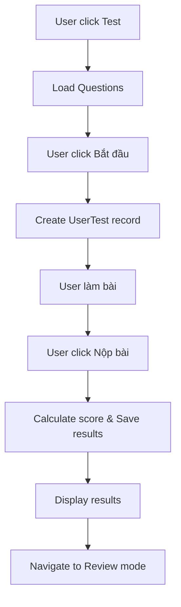

# 📚 HƯỚNG DẪN QUY TRÌNH LÀEM TEST - TOEIC CHATBOT SYSTEM

> **Tài liệu mô tả chi tiết luồng xử lý từ khi user bắt đầu làm test đến khi nộp bài và xem kết quả**

---

## 📋 **MỤC LỤC**

1. [Tổng quan quy trình](#tổng-quan-quy-trình)
2. [Chi tiết từng bước](#chi-tiết-từng-bước)
3. [Cấu trúc dữ liệu](#cấu-trúc-dữ-liệu)
4. [Database operations](#database-operations)
5. [Error handling](#error-handling)
6. [Audio timing features](#audio-timing-features)

---

## 🎯 **TỔNG QUAN QUY TRÌNH**



### **🔄 Flow Summary:**
1. **Load Test** → Get questions with media
2. **Start Test** → Create UserTest record  
3. **Take Test** → User answers questions
4. **Submit Test** → Calculate score & save
5. **Show Results** → Display summary
6. **Review Mode** → Detailed analysis with audio replay

---

## 📝 **CHI TIẾT TỪNG BƯỚC**

### **🚀 STEP 1: User Vào Trang Exam**

#### Frontend Route:
```typescript
// URL: /TestExam/:id (testId)
// Component: TestExam với mode="exam"
```

#### API Call:
```typescript
getQuestionsByTestIdAPI(testId: number): Promise<QuestionWithMedia[]>
```

**Request:**
```http
GET /api/questionTest/Detail/${testId}
Headers: { withCredentials: true }
```

**Backend Function:** `RandomQuestionsByTestId(testId, limit = null)`

**Backend Processing:**
1. Lấy tất cả questions từ `TestQuestion` table
2. Shuffle ngẫu nhiên (không giới hạn số lượng)
3. Include media mappings với timing info
4. Transform field names: `mediaType → type`, `mediaUrl → url`

**Response Example:**
```json
[
  {
    "id": 1,
    "question": "Look at the picture. What is happening?",
    "optionA": "People are walking",
    "optionB": "People are sitting", 
    "optionC": "People are running",
    "optionD": "People are standing",
    "correctAnswer": "A",
    "explanation": "The picture shows people walking on the street.",
    "typeId": 1,
    "partId": 1,
    "mediaMappings": [{
      "id": 1,
      "startSecond": 5.0,
      "endSecond": 15.5,
      "sortOrder": 1,
      "media": {
        "id": 1,
        "type": "audio",
        "url": "http://localhost:8080/uploads/audio/track1.mp3",
        "description": "Listening audio for question 1"
      }
    }]
  }
  // ... more questions
]
```

---

### **🎬 STEP 2: User Bấm "Bắt Đầu"**

#### API Call:
```typescript
startTestAPI(testId: number): Promise<StartTestResult>
```

**Request:**
```http
POST /api/questionTest/StartTest/${testId}
Body: {}
Headers: { withCredentials: true }
```

**Backend Function:** `StartUserTest({ userId, testId })`

**Database Operations:**
```sql
-- 1. Tạo UserTest record
INSERT INTO UserTest (userId, testId, status, startedAt, score)
VALUES (userId, testId, 'in_progress', NOW(), 0);

-- 2. Tăng participants count  
UPDATE Tests SET participants = participants + 1 WHERE id = testId;
```

**Response:**
```json
{
  "userTestId": 156,
  "message": "Test started successfully"
}
```

**Frontend State Update:**
```typescript
setStartTime(new Date());
setShowStartPopup(false);
```

---

### **✏️ STEP 3: User Làm Bài**

#### Frontend State Management:
```typescript
// Lưu câu trả lời
const [userAnswers, setUserAnswers] = useState<{ [questionId: number]: string }>({});
// Example: { 1: "A", 2: "B", 3: "C", 4: "" }

// Track câu đã trả lời
const [answeredQuestions, setAnsweredQuestions] = useState<number[]>([]);
// Example: [1, 2, 3] 
```

#### User Interactions:
- **Select answer:** `setUserAnswers({ ...prev, [questionId]: "A" })`
- **Audio replay:** `handleAudioReplay(startSecond, endSecond)`
- **Navigation:** Scroll to specific question
- **Part filtering:** Filter questions by TOEIC parts

#### Audio Features:
- **Global audio player** với controls
- **Question-specific timing** (startSecond, endSecond)
- **Auto-pause** khi hết segment
- **Immediate switching** giữa các câu

---

### **📤 STEP 4: User Bấm "Nộp Bài"**

#### Frontend Data Preparation:
```typescript
const answersArray = questionData.map(q => ({
  questionId: q.id,
  selectedAnswer: userAnswers[q.id] || "", // Empty string for skipped
}));
```

#### API Call:
```typescript
submitTestAPI(testId: number, answers: Answer[]): Promise<SubmitResult>
```

**Request:**
```http
POST /api/questionTest/Submit/${testId}
Body: {
  "answers": [
    { "questionId": 1, "selectedAnswer": "A" },
    { "questionId": 2, "selectedAnswer": "B" },
    { "questionId": 3, "selectedAnswer": "" },  // Skipped
    { "questionId": 4, "selectedAnswer": "D" }
    // ... all questions (including unanswered)
  ]
}
Headers: { withCredentials: true }
```

---

### **🔍 STEP 5: Backend Score Processing**

**Backend Function:** `SubmitTestResult({ userId, testId, answers })`

#### **5.1 Find UserTest Record:**
```sql
SELECT * FROM UserTest 
WHERE userId = ? AND testId = ? AND status = 'in_progress'
ORDER BY startedAt DESC LIMIT 1;
```

#### **5.2 Validate Questions:**
```sql
SELECT questionId FROM TestQuestion WHERE testId = ?;
```
```javascript
const validQuestionIds = validQuestions.map(q => q.questionId);
const filteredAnswers = answers.filter(a => validQuestionIds.includes(a.questionId));
```

#### **5.3 Score Calculation:**
```javascript
let correctCount = 0;
const incorrectAnswers = [];

for (const { questionId, selectedAnswer } of filteredAnswers) {
  const question = await db.Question.findByPk(questionId);
  const isCorrect = question.correctAnswer === selectedAnswer;
  
  if (isCorrect) {
    correctCount++;
  } else {
    incorrectAnswers.push({
      questionId,
      correctAnswer: question.correctAnswer,
      selectedAnswer,
      explanation: question.explanation,
    });
  }
}

// ✅ Score calculation based on TOTAL questions in test
const totalQuestions = validQuestionIds.length; // Not answered questions count
const score = Math.round((correctCount / totalQuestions) * 10 * 10) / 10;
```

#### **5.4 Save UserResults:**
```sql
INSERT INTO UserResults (userId, userTestId, questionId, selectedOption, isCorrect, answeredAt)
VALUES 
  (userId, userTestId, 1, 'A', 1, NOW()),
  (userId, userTestId, 2, 'B', 0, NOW()),
  (userId, userTestId, 3, NULL, 0, NOW()),  -- Skipped = wrong
  (userId, userTestId, 4, 'D', 1, NOW());
```

#### **5.5 Update UserTest:**
```sql
UPDATE UserTest SET 
  score = ?,
  completedAt = NOW(),
  status = 'completed'
WHERE id = userTestId;
```

#### **5.6 Update Statistics:**
```sql
MERGE QuestionStats AS target
USING (
  SELECT questionId,
    COUNT(*) AS attempts,
    SUM(CASE WHEN isCorrect = 1 THEN 1 ELSE 0 END) AS correct
  FROM UserResults GROUP BY questionId
) AS src
ON target.questionId = src.questionId
WHEN MATCHED THEN 
  UPDATE SET attempts = src.attempts, correct = src.correct
WHEN NOT MATCHED THEN 
  INSERT (questionId, attempts, correct) 
  VALUES (src.questionId, src.attempts, src.correct);
```

---

### **📊 STEP 6: Backend Response**

**Response Structure:**
```json
{
  "message": "Submit successful",
  "userTestId": 156,
  "correctCount": 35,
  "total": 50,
  "score": 7.0,
  "incorrectAnswers": [
    {
      "questionId": 2,
      "correctAnswer": "C",
      "selectedAnswer": "B", 
      "explanation": "The correct answer is C because...",
      "startSecond": 20.0,
      "endSecond": 28.3
    },
    {
      "questionId": 3,
      "correctAnswer": "A",
      "selectedAnswer": "",
      "explanation": "Option A is correct as it refers to...",
      "startSecond": 35.7,
      "endSecond": 47.2
    }
    // ... more incorrect answers with timing info
  ]
}
```

---

### **🎨 STEP 7: Frontend Display Results**

#### State Updates:
```typescript
setCorrectCount(result.correctCount);     // 35
setIncorrectAnswers(result.incorrectAnswers); // Array with timing info
setScore(result.score);                   // 7.0  
setTotalQuestions(result.total);          // 50
setShowResult(true);                      // Show result UI
```

#### UI Components:
```tsx
// Summary Box
<span className="big-score">{correctCount}/{totalQuestions}</span>  // "35/50"
<span className="accuracy">
  🎯 Độ chính xác: <strong>{((correctCount/totalQuestions)*100).toFixed(1)}%</strong>
</span>  // "70.0%"

// Status Breakdown
<div className="status correct">
  <span>✔ Trả lời đúng</span>
  <p>{correctCount} câu hỏi</p>  // 35 câu hỏi
</div>
<div className="status incorrect">
  <span>✘ Trả lời sai</span>
  <p>{incorrectAnswers.length} câu hỏi</p>  // 13 câu hỏi
</div>
<div className="status skipped">
  <span>➖ Bỏ qua</span>
  <p>{totalQuestions - correctCount - incorrectAnswers.length} câu hỏi</p>  // 2 câu hỏi
</div>
```

---

## 🗄️ **CẤU TRÚC DỮ LIỆU**

### **Database Tables:**

#### **Tests:**
```sql
CREATE TABLE Tests (
  id INT PRIMARY KEY,
  title VARCHAR(255),
  courseId INT,
  participants INT DEFAULT 0,
  createdAt DATETIME,
  updatedAt DATETIME
);
```

#### **Questions:**
```sql
CREATE TABLE Questions (
  id INT PRIMARY KEY,
  question TEXT,
  optionA VARCHAR(255),
  optionB VARCHAR(255), 
  optionC VARCHAR(255),
  optionD VARCHAR(255),
  correctAnswer CHAR(1),
  explanation TEXT,
  typeId INT,
  partId INT
);
```

#### **TestQuestion (Junction Table):**
```sql
CREATE TABLE TestQuestion (
  testId INT,
  questionId INT,
  sortOrder INT,
  PRIMARY KEY (testId, questionId)
);
```

#### **UserTest:**
```sql
CREATE TABLE UserTest (
  id INT PRIMARY KEY,
  userId INT,
  testId INT,
  status VARCHAR(50), -- 'in_progress', 'completed'
  startedAt DATETIME,
  completedAt DATETIME,
  score DECIMAL(3,1) -- 0.0 to 10.0
);
```

#### **UserResults:**
```sql
CREATE TABLE UserResults (
  id INT PRIMARY KEY,
  userId INT,
  userTestId INT,
  questionId INT,
  selectedOption CHAR(1), -- NULL for skipped
  isCorrect BOOLEAN,
  answeredAt DATETIME
);
```

#### **MediaFiles:**
```sql
CREATE TABLE MediaFiles (
  id INT PRIMARY KEY,
  mediaType VARCHAR(50), -- 'audio', 'image'
  mediaUrl VARCHAR(500),
  description TEXT,
  duration DECIMAL(10,2) -- seconds
);
```

#### **QuestionMediaMap:**
```sql
CREATE TABLE QuestionMediaMap (
  id INT PRIMARY KEY,
  questionId INT,
  mediaId INT,
  startSecond DECIMAL(10,2), -- Audio start time
  endSecond DECIMAL(10,2),   -- Audio end time  
  sortOrder INT
);
```

#### **QuestionStats (Analytics):**
```sql
CREATE TABLE QuestionStats (
  questionId INT PRIMARY KEY,
  attempts INT DEFAULT 0,
  correct INT DEFAULT 0
);
```

---

## 🎵 **AUDIO TIMING FEATURES**

### **Audio Replay System:**

#### **Backend Data:**
- `startSecond` và `endSecond` trong `QuestionMediaMap`
- Timing info được trả về trong `incorrectAnswers`

#### **Frontend Implementation:**
```typescript
const handleAudioReplay = (startSecond?: number, endSecond?: number) => {
  const audioElement = document.querySelector('.global-audio-player') as HTMLAudioElement;
  
  // Clear previous listener
  if (currentAudioListenerRef.current) {
    audioElement.removeEventListener('timeupdate', currentAudioListenerRef.current);
  }
  
  // Stop current playback and jump to new position
  audioElement.pause();
  audioElement.currentTime = startSecond || 0;
  audioElement.play();
  
  // Auto-pause at endSecond
  if (endSecond) {
    const checkTime = () => {
      if (audioElement.currentTime >= endSecond) {
        audioElement.pause();
        audioElement.removeEventListener('timeupdate', checkTime);
      }
    };
    audioElement.addEventListener('timeupdate', checkTime);
    currentAudioListenerRef.current = checkTime;
  }
};
```

#### **UI Components:**
```tsx
// Replay button for incorrect answers
{hasGlobalAudio && incorrectAnswer.startSecond !== undefined && (
  <button 
    className="audio-replay-btn"
    onClick={() => handleReplayClick()}
    title={`Nghe lại đoạn audio từ ${startSecond}s đến ${endSecond}s`}
  >
    🎵 Nghe lại câu này
  </button>
)}
```

---

## 🔄 **REVIEW MODE WORKFLOW**

### **Navigation to Review:**
```typescript
// From test history page
<Link to={`/test-review-detail/${userTestId}`}>
  Xem chi tiết
</Link>
```

### **Load Review Data:**
```typescript
getUserTestDetailByIdAPI(userTestId: number): Promise<UserTestDetailResult>
```

**Backend Function:** `GetUserTestDetailById(userTestId)`

**Response includes:**
- Complete UserTest info (score, timing, status)
- All questions with user's answers
- Media files with timing for audio replay
- Correct/incorrect analysis

---

## 🚨 **ERROR HANDLING**

### **Frontend Error Handling:**
```typescript
try {
  const result = await submitTestAPI(testId, answers);
  // Success handling
} catch (error) {
  console.error("Lỗi submit bài:", error);
  // Show error message to user
}
```

### **Backend Error Scenarios:**
1. **User not authenticated** → 401 Unauthorized
2. **Invalid testId** → 400 Bad Request  
3. **Test already completed** → 409 Conflict
4. **Database errors** → 500 Internal Server Error
5. **Deadlock handling** → Retry with exponential backoff

---

## 📈 **PERFORMANCE CONSIDERATIONS**

### **Database Optimizations:**
- Indexes on foreign keys (`userId`, `testId`, `questionId`)
- Transaction usage for data consistency
- Bulk insert for `UserResults`
- Query optimization with proper JOINs

### **Frontend Optimizations:**
- Lazy loading for media files
- State management for large question sets
- Debounced audio controls
- Efficient re-renders with React.memo

---

## 🧪 **TESTING DATA EXAMPLES**

### **Test với Audio Timing:**
```json
{
  "title": "TOEIC Listening Part 1 - Photographs",
  "questions": [
    {
      "question": "Look at the picture. What is happening?",
      "audioPath": "/uploads/audio/track1.mp3",
      "startSecond": 5.0,
      "endSecond": 15.5,
      "correctAnswer": "A",
      "explanation": "People are walking in the picture."
    }
  ]
}
```

### **Score Calculation Examples:**
```
Scenario 1: 35/50 correct = 7.0 points
Scenario 2: 40/50 correct = 8.0 points  
Scenario 3: 25/50 correct = 5.0 points
Scenario 4: 50/50 correct = 10.0 points
```

---

## 📚 **TÀI LIỆU THAM KHẢO**

### **Files liên quan:**
- `src/services/question_test_services.ts` - Frontend API calls
- `src/controllers/question_test_controller.js` - Backend controllers
- `src/services/question_test_service.js` - Backend business logic
- `src/container/test_exam.tsx` - Main exam component
- `src/components/Card Question.tsx` - Question component với audio replay

### **Database Schema:**
- Xem file `database-schema.sql` để biết cấu trúc đầy đủ
- Migration files trong `migrations/` folder

### **API Documentation:**
- Base URL: `http://localhost:8080/api/questionTest`
- Authentication: Cookie-based với `withCredentials: true`
- Rate limiting: Implemented per user session

---

**📅 Last Updated:** October 4, 2025  
**🔄 Version:** 2.0 (với Audio Timing Support)  
**👨‍💻 Maintained by:** TOEIC Chatbot Development Team

---

> **💡 Lưu ý:** Tài liệu này mô tả quy trình hiện tại và sẽ được cập nhật khi có thay đổi trong system. Để biết thêm chi tiết, vui lòng tham khảo source code và database schema.