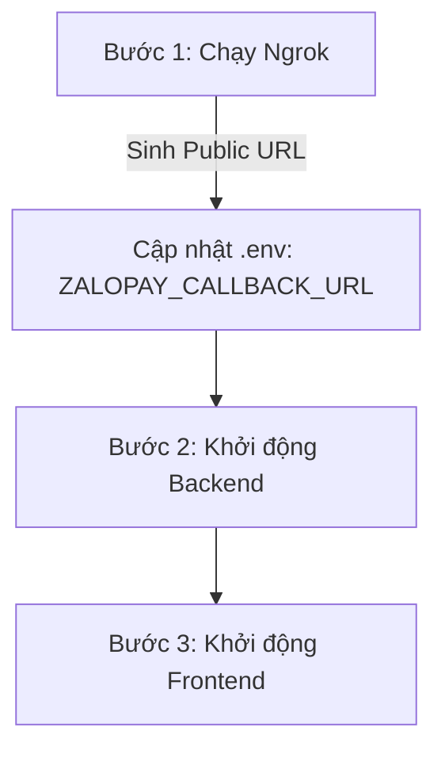

# 🎬 TÓM TẮT HƯỚNG DẪN CÀI ĐẶT & CẤU HÌNH THANH TOÁN ZALOPAY

Tài liệu này tóm tắt quy trình cài đặt, cấu hình môi trường, luồng nghiệp vụ và đặc tả chi tiết các API thanh toán ZaloPay (Dynamic QR) được tích hợp trong dự án đặt vé xem phim **XEMPHIM**.

---

## ⚙️ 1. Cấu hình môi trường (`.env`)

Để tích hợp và vận hành cổng thanh toán ZaloPay (môi trường Sandbox), cần định nghĩa các khóa cấu hình sau trong file `.env` của Backend:

```env
# ZaloPay Integration Keys (Sandbox mặc định của ZaloPay)
APP_ID=2554
KEY1=sdngKKJmqEMzvh5QQcdD2A9XBSKUNaYn     # Dùng để tạo chữ ký MAC khi gửi dữ liệu sang ZaloPay
KEY2=trMrHtvjo6myautxDUiAcYsVtaeQ8nhf     # Dùng để xác thực chữ ký MAC nhận từ webhook ZaloPay
ZALOPAY_ENDPOINT=https://sb-openapi.zalopay.vn

# Webhook Callback URL (Nhận kết quả giao dịch từ ZaloPay)
ZALOPAY_CALLBACK_URL=https://<your-ngrok-subdomain>.ngrok-free.dev/api/zalopay/callback
```

> [!WARNING]
> Môi trường **Sandbox** phục vụ mục đích kiểm thử và không trừ tiền thật. Khi chạy hệ thống thực tế (**Production**), các thông tin trên phải được thay thế bằng thông tin do ZaloPay cấp chính thức và bảo mật tuyệt đối.

---

## 🚀 2. Quy trình khởi động hệ thống kiểm thử

Để luồng thanh toán ZaloPay hoạt động trên máy cục bộ (localhost), cần thực hiện 3 bước khởi động sau:



### 🔹 Bước 1: Khởi chạy Ngrok (Tạo kênh kết nối cho Webhook ZaloPay)
ZaloPay yêu cầu một địa chỉ HTTPS công khai để gọi webhook (callback). Sử dụng Ngrok để chuyển tiếp cổng `8080`:
```powershell
ngrok http 8080
```
*Sao chép URL HTTPS được sinh ra dạng `https://xxx.ngrok-free.dev` và cập nhật vào biến `ZALOPAY_CALLBACK_URL` trong file `.env`.*

### 🔹 Bước 2: Khởi động Backend
```powershell
cd d:\XEMPHIM\XEMPHIM
# Hoặc thư mục chứa backend
npm run dev
```

### 🔹 Bước 3: Khởi động Frontend
```powershell
# Chạy dự án react frontend
npm start
```

---

## 🔄 3. Luồng nghiệp vụ Đặt vé & Thanh toán QR

Quy trình thanh toán bằng mã QR động diễn ra như sau:

1. **Chọn Ghế & Giữ Chỗ (Lock):** User chọn ghế -> Gọi `POST /api/bookings/lock-seat` -> Ghế chuyển trạng thái sang `locked` (giữ chỗ trong 5 phút).
2. **Tạo Đơn Hàng ZaloPay:** Backend gọi API ZaloPay để khởi tạo giao dịch -> Nhận về `order_url` -> Lưu thông tin thanh toán ở trạng thái `pending`.
3. **Hiển thị Mã QR:** Frontend nhận `order_url` từ Backend và render thành mã QR động (sử dụng thư viện `<QRCodeSVG />`).
4. **Quét QR & Thanh Toán:** User dùng app ZaloPay quét QR trên màn hình điện thoại/máy tính và hoàn tất thanh toán.
5. **Nhận Webhook Callback:** ZaloPay gửi callback về Backend thông qua Ngrok URL -> Backend kiểm tra chữ ký số MAC hợp lệ -> Chuyển trạng thái Booking sang `confirmed`, chuyển trạng thái thanh toán sang `paid`, và khóa cứng ghế đặt (`booked`).
6. **Xác nhận giao dịch:** Frontend liên tục polling kiểm tra trạng thái booking mỗi 3 giây, khi phát hiện trạng thái đã chuyển sang `confirmed` -> hiển thị thông báo thành công và chuyển hướng tới màn hình xem vé.

---

## 🔌 4. Đặc tả các API thanh toán và tạo mã QR

Dưới đây là danh sách chi tiết các API ZaloPay được cấu hình và sử dụng trong file [zalopayService.js](file:///d:/XEMPHIM/XEMPHIM/services/payment-service/services/zalopayService.js):

### 1️⃣ API Tạo Đơn Hàng & Mã QR (Create Order)
API này được gọi từ backend để đăng ký đơn hàng với ZaloPay và lấy thông tin đường dẫn sinh mã QR.

*   **Endpoint:** `POST https://sb-openapi.zalopay.vn/v2/create`
*   **Content-Type:** `application/x-www-form-urlencoded`
*   **Tham số Payload:**

| Tham số | Loại | Mô tả |
| :--- | :--- | :--- |
| `app_id` | `Number` | ID ứng dụng đăng ký với ZaloPay (Ví dụ: `2554`). |
| `app_trans_id` | `String` | Mã giao dịch duy nhất của đơn hàng. Định dạng: `YYMMDD_randomID`. |
| `app_user` | `String` | ID của khách hàng thực hiện thanh toán (Ví dụ: `user_bookingId`). |
| `app_time` | `Number` | Thời gian tạo đơn hàng (Epoch time tính bằng mili giây). |
| `amount` | `Number` | Số tiền cần thanh toán (VNĐ). |
| `item` | `String` | JSON array thông tin các mặt hàng (booking id, tên vé, giá...). |
| `embed_data` | `String` | Dữ liệu tùy biến lưu metadata (như redirecturl, booking_code, booking_id). |
| `callback_url`| `String` | URL nhận kết quả thanh toán khi khách hàng thanh toán thành công. |
| `description` | `String` | Mô tả ngắn gọn về đơn hàng hiển thị trên app ZaloPay. |
| `bank_code` | `String` | Để trống nếu muốn user quét mã QR tự chọn nguồn tiền hoặc điền mã ngân hàng cụ thể. |
| `mac` | `String` | Chữ ký số tạo bằng thuật toán **HMAC-SHA256** kết hợp `KEY1` theo định dạng: `app_id\|app_trans_id\|app_user\|amount\|app_time\|embed_data\|item`. |

*   **Response Trả Về:**
    ```json
    {
      "return_code": 1,
      "return_message": "Giao dịch thành công",
      "sub_return_code": 1,
      "sub_return_message": "Giao dịch thành công",
      "order_url": "https://qcgateway.zalopay.vn/openinapp?order=eyJ6cHRyYW5zdG9rZW4iOi...",
      "zp_trans_token": "ACV2no62KDlpOD_mhJUgHOYA"
    }
    ```
    *(Dùng giá trị `order_url` truyền vào Frontend để render thành hình ảnh mã QR).*

---

### 2️⃣ API Callback Webhook (Nhận Kết Quả Giao Dịch)
ZaloPay tự động gửi yêu cầu POST đến callback URL của merchant khi giao dịch thành công.

*   **Endpoint:** `{merchant_domain}/api/zalopay/callback`
*   **Request Body:**
    ```json
    {
      "data": "{\"app_id\":2554,\"app_trans_id\":\"251024_641790\",\"app_user\":\"user_69\",\"amount\":5000,...}",
      "mac": "0b234e3d9a534ee8709a80547441712ab5266bc813e5b62a9afd983ae2809a53"
    }
    ```
*   **Xác thực bảo mật:**
    Backend bắt buộc phải tính toán lại mã MAC và so sánh với MAC nhận được để tránh bị giả mạo thông tin giao dịch:
    $$\text{calculatedMac} = \text{HMAC-SHA256}(\text{data}, \text{KEY2})$$
*   **Phản hồi gửi lại ZaloPay:**
    ```json
    {
      "return_code": 1,
      "return_message": "success"
    }
    ```

---

### 3️⃣ API Truy Vấn Trạng Thuật Đơn Hàng (Query Order)
Sử dụng khi không nhận được callback hoặc thực hiện kiểm tra chủ động trạng thái đơn hàng.

*   **Endpoint:** `POST https://sb-openapi.zalopay.vn/v2/query`
*   **Content-Type:** `application/x-www-form-urlencoded`
*   **Tham số Payload:**
    *   `app_id`: ID Merchant
    *   `app_trans_id`: Mã giao dịch cần kiểm tra
    *   `mac`: Chữ ký số tạo bằng công thức: `app_id|app_trans_id|KEY1`
*   **Response Trả Về:**
    ```json
    {
      "return_code": 1, 
      "return_message": "Giao dịch thành công",
      "is_processing": false,
      "amount": 5000,
      "zp_trans_id": 251024000114790
    }
    ```

---

### 4️⃣ API Hoàn Tiền (Refund Order)
Dùng để hoàn tiền lại vào tài khoản ví ZaloPay của người dùng (Chỉ áp dụng với vé đặt thành công trước giờ chiếu tối thiểu 2 tiếng).

*   **Endpoint:** `POST https://sb-openapi.zalopay.vn/v2/refund`
*   **Content-Type:** `application/json`
*   **Tham số Payload:**
    *   `app_id`: ID Merchant
    *   `m_refund_id`: Mã hoàn tiền tự sinh duy nhất. Định dạng: `YYMMDD_appId_randomId`
    *   `zp_trans_id`: Mã giao dịch gốc của ZaloPay khi thanh toán thành công (`zp_trans_id`)
    *   `amount`: Số tiền hoàn (VNĐ)
    *   `refund_fee_amount`: Phí hoàn tiền (mặc định là `0`)
    *   `timestamp`: Epoch time lúc hoàn tiền
    *   `description`: Lý do hoàn tiền
    *   `mac`: Chữ ký số tạo bằng công thức: `app_id|zp_trans_id|amount|refund_fee_amount|description|timestamp` dùng `KEY1`
*   **Response Trả Về:**
    ```json
    {
      "return_code": 3, // 1: Thành công lập tức, 3: Đang xử lý
      "return_message": "Giao dịch đang refund!",
      "refund_id": "251024000115043"
    }
    ```

---

### 5️⃣ API Truy Vấn Trạng Thái Hoàn Tiền (Query Refund Status)
Kiểm tra kết quả của yêu cầu hoàn tiền.

*   **Endpoint:** `POST https://sb-openapi.zalopay.vn/v2/query_refund`
*   **Content-Type:** `application/x-www-form-urlencoded`
*   **Tham số Payload:**
    *   `app_id`: ID Merchant
    *   `m_refund_id`: Mã yêu cầu hoàn tiền cần kiểm tra
    *   `timestamp`: Epoch time lúc truy vấn
    *   `mac`: Chữ ký số tạo bằng công thức: `app_id|m_refund_id|timestamp` dùng `KEY1`
*   **Response Trả Về:**
    ```json
    {
      "return_code": 1, // 1: Hoàn tiền thành công, 2: Thất bại, 3: Đang xử lý
      "return_message": "Thành công",
      "refund_amount": 5000
    }
    ```
